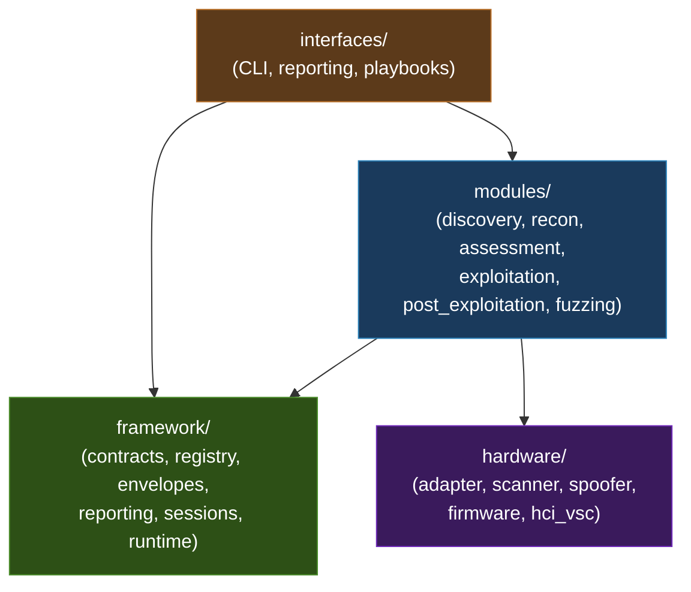
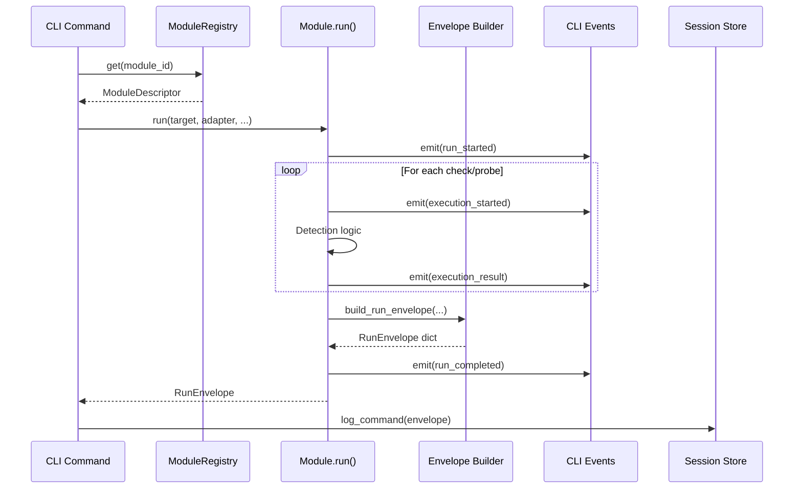
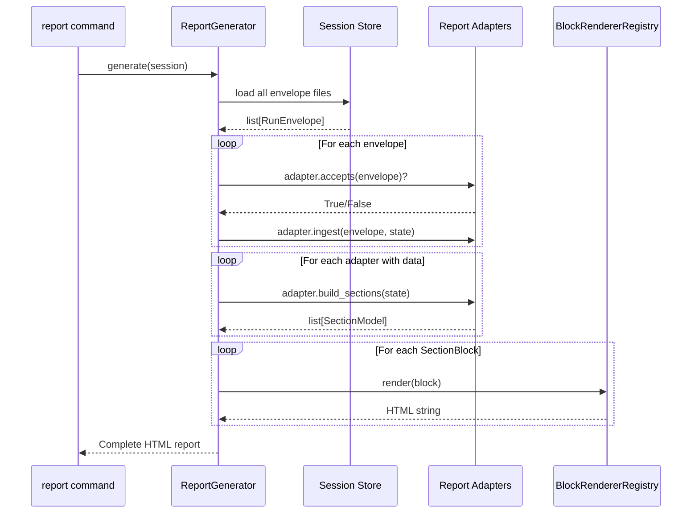
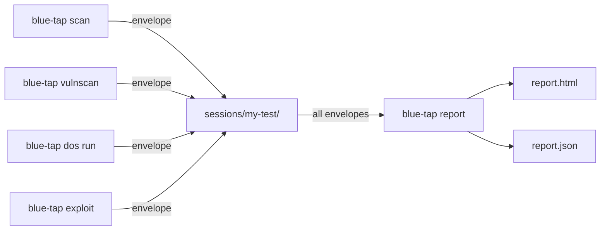

# Architecture Reference

This document describes the internal architecture of Blue-Tap: package layout, design principles, data flow, core abstractions, and the status taxonomy.

---

## Design Philosophy

Blue-Tap's architecture separates **what the tool can do** (modules), **how it's structured** (framework), and **how users interact with it** (interfaces). This three-layer split exists for concrete reasons:

- **Framework stays stable.** The contracts (`RunEnvelope`, `ExecutionRecord`, `ReportAdapter`) change rarely. When they do, every module and interface must update. Keeping framework code isolated means you can add 50 modules without touching the envelope schema once.
- **Modules stay independent.** A CVE check for L2CAP should never import from the fuzzer, and the fuzzer should never import from the CLI. Cross-family imports create hidden coupling that makes modules untestable in isolation.
- **Interfaces are replaceable.** The CLI is one interface. A REST API, a GUI, or a CI/CD integration would be another. None of them contain business logic -- they delegate to modules and framework.

### If You're Coming from Metasploit

| Metasploit Concept | Blue-Tap Equivalent | Key Difference |
|---|---|---|
| Module (exploit/auxiliary/post) | Module in `modules/<family>/` | Blue-Tap modules return structured `RunEnvelope` data, not session objects |
| Datastore options | `run()` kwargs + CLI options | No global mutable datastore; explicit parameter passing |
| Module mixins | Framework envelope builders | Composition over inheritance; builders are functions, not base classes |
| `report_*` methods | Report adapters | Adapters are separate classes, not mixed into the module |
| Session (Meterpreter) | `framework/sessions/store.py` | Blue-Tap sessions are JSON logs, not interactive shells |
| `db_*` commands | Session directory + JSON files | File-based, no external database required |
| Module ranking | `ModuleDescriptor.destructive` | Binary flag rather than a ranking scale |

---

## Package Layout

```
blue_tap/
  framework/                   # Stable contracts, registry, envelopes, reporting, sessions
    contracts/                 # result_schema.py, report_contract.py
    runtime/                   # cli_events.py
    envelopes/                 # Family-specific envelope builders
    registry/                  # ModuleDescriptor, ModuleFamily, ModuleRegistry
    reporting/
      adapters/                # 11 report adapters (one per module type)
      renderers/               # html.py, blocks.py, registry.py, sections.py
    sessions/                  # store.py (atomic persistence)
  modules/                     # Domain behavior (101 modules across 6 families)
    discovery/                 # 1 module -- target scanning
    reconnaissance/            # 13 modules -- deep enumeration
    assessment/                # 39 modules -- vulnerability checks
    exploitation/              # 38 modules (8 attacks + dos_runner + 29 DoS checks)
    post_exploitation/         # 7 modules -- data extraction, media control
    fuzzing/                   # 3 registered + engine, transport, corpus, crash_db
  interfaces/                  # User-facing integration surfaces
    cli/                       # Click commands (LoggedCommand / LoggedGroup)
    reporting/                 # ReportGenerator orchestration
    playbooks/                 # PlaybookLoader
  hardware/                    # Low-level primitives
    adapter.py                 # HCI management, chipset detection
    scanner.py                 # Classic + BLE scanning
    spoofer.py                 # MAC spoofing (4 methods)
    firmware.py                # DarkFirmware (RTL8761B)
    hci_vsc.py                 # Vendor-specific HCI commands
    obex_client.py             # OBEX D-Bus client
  utils/                       # Shared helpers (bt_helpers, output, interactive, env_doctor)
```

---

## Design Principles

| Layer | Rule | Rationale |
|---|---|---|
| `framework/` | Infrastructure only. **Never** imports from `modules/`. | Framework is the foundation -- it must not depend on the things built on top of it. |
| `modules/` | Business logic. Imports `framework/` and `hardware/`. **No cross-family imports.** | Modules must be independently testable. A bug in the fuzzer must never break the vulnerability scanner. |
| `interfaces/` | Presentation. Imports `modules/` and `framework/`. | Interfaces wire modules to user input/output. They contain no detection logic. |
| `hardware/` | Low-level primitives. Used by `modules/`. | Hardware abstraction isolates platform-specific code (HCI sockets, USB, D-Bus). |

Old paths (`core/`, `attack/`, `recon/`, `fuzz/`, `report/`) contain deprecation notices only. Never import from them.

### Dependency Direction



Arrows point in the direction of allowed imports. No arrow from `framework` to `modules` means framework code never imports module code. No arrow between module families means no cross-family imports.

---

## Data Flow

### Module Execution Flow



### Report Generation Flow



### Narrative Data Flow

1. A Click command resolves its module via `ModuleRegistry`.
2. The module executes, building a `RunEnvelope` through the family envelope builder.
3. CLI events are emitted during execution for real-time operator feedback.
4. The envelope is logged to the active session (atomic JSON writes).
5. At report time, each report adapter ingests matching envelopes, produces `SectionModel` objects, and the renderer converts them to HTML.

---

## Core Abstractions

### RunEnvelope

The universal output container for every module run. Built by `build_run_envelope()` in `blue_tap.framework.contracts.result_schema`.

| Field | Type | Description |
|---|---|---|
| `schema` | `str` | Module schema identifier, e.g. `"blue_tap.vulnscan.result"` |
| `schema_version` | `int` | Always `2` (constant `SCHEMA_VERSION`) |
| `module` | `str` | Module name |
| `run_id` | `str` | Unique run identifier (UUID or `{module}-{uuid}`) |
| `target` | `str` | Target address |
| `adapter` | `str` | HCI adapter used |
| `started_at` | `str` | ISO 8601 timestamp |
| `completed_at` | `str` | ISO 8601 timestamp |
| `operator_context` | `dict` | Operator-supplied context |
| `summary` | `dict` | Module-specific summary |
| `executions` | `list[dict]` | List of `ExecutionRecord` dicts |
| `artifacts` | `list[dict]` | List of `ArtifactRef` dicts |
| `module_data` | `dict` | Module-specific payload |

### ExecutionRecord

One execution within a run. Built by `make_execution()`.

| Field | Type | Description |
|---|---|---|
| `execution_id` | `str` | Unique within the run (UUID) |
| `kind` | `str` | `"check"`, `"collector"`, `"probe"`, `"phase"`, or `"operation"` |
| `id` | `str` | Stable machine identifier |
| `title` | `str` | Human-readable title |
| `module` | `str` | Module name |
| `protocol` | `str` | Protocol used |
| `execution_status` | `str` | Lifecycle status (see taxonomy below) |
| `module_outcome` | `str` | Semantic result (family-specific, see below) |
| `severity` | `str \| None` | Optional severity level |
| `destructive` | `bool` | Whether the execution modifies target state |
| `requires_pairing` | `bool` | Whether pairing is mandatory |
| `started_at` | `str` | ISO 8601 timestamp |
| `completed_at` | `str` | ISO 8601 timestamp |
| `evidence` | `dict` | `EvidenceRecord` dict |
| `notes` | `list[str]` | Operator notes |
| `tags` | `list[str]` | Machine tags |
| `artifacts` | `list[dict]` | Execution-level artifacts |
| `module_data` | `dict` | Execution-level module data |
| `error` | `str \| None` | Error message (present only on failure) |

### EvidenceRecord

Frozen dataclass capturing evidence from a single execution. Built by `make_evidence()`.

| Field | Type | Default |
|---|---|---|
| `summary` | `str` | *(required)* |
| `confidence` | `str` | `"medium"` -- one of `high`, `medium`, `low` |
| `observations` | `tuple[str, ...]` | `()` |
| `packets` | `tuple[dict, ...]` | `()` |
| `responses` | `tuple[str, ...]` | `()` |
| `state_changes` | `tuple[str, ...]` | `()` |
| `artifacts` | `tuple[dict, ...]` | `()` |
| `capability_limitations` | `tuple[str, ...]` | `()` |
| `module_evidence` | `dict[str, Any]` | `{}` |

### ArtifactRef

Frozen dataclass referencing a saved artifact. Built by `make_artifact()`.

| Field | Type | Default |
|---|---|---|
| `artifact_id` | `str` | *(required)* -- UUID |
| `kind` | `str` | *(required)* -- e.g. `"pcap"`, `"log"`, `"json"` |
| `label` | `str` | *(required)* -- human-readable label |
| `path` | `str` | *(required)* -- filesystem path |
| `description` | `str` | `""` |
| `created_at` | `str` | `""` |
| `execution_id` | `str` | `""` |

---

## Module Families and Outcomes

| Family | Purpose | Allowed `module_outcome` values |
|---|---|---|
| **discovery** | Nearby target inventory | `observed`, `merged`, `correlated`, `partial`, `not_applicable` |
| **reconnaissance** | Deep per-target analysis | `observed`, `merged`, `correlated`, `partial`, `not_applicable`, `unsupported_transport`, `collector_unavailable`, `prerequisite_missing`, `artifact_collected`, `hidden_surface_detected`, `no_relevant_traffic` |
| **assessment** | Vulnerability checks | `confirmed`, `inconclusive`, `pairing_required`, `not_applicable`, `not_detected` |
| **exploitation** | Active attacks | `success`, `unresponsive`, `recovered`, `not_applicable`, `aborted`, `confirmed` |
| **post_exploitation** | Data extraction, media | `extracted`, `connected`, `streamed`, `transferred`, `not_applicable`, `partial`, `completed`, `failed`, `aborted` |
| **fuzzing** | Protocol mutation/stress | `crash_found`, `timeout`, `corpus_grown`, `no_findings`, `completed`, `crash_detected`, `degraded`, `aborted`, `pairing_required`, `not_applicable`, `reproduced` |

The canonical outcomes (first 4-5 per family) match the architecture rule in `.claude/rules/blue-tap-architecture.md`. The extended values accommodate legacy envelope builders and cross-phase checks.

---

## Status Taxonomy

Blue-Tap uses two distinct status fields. **Never conflate them.**

### `execution_status` -- Lifecycle

Answers: *"Did the execution run to completion?"*

| Value | Meaning |
|---|---|
| `completed` | Ran to completion (result may be positive or negative) |
| `failed` | Ran but encountered an expected failure condition |
| `error` | Unexpected error / exception |
| `skipped` | Intentionally not run (prerequisite missing, not applicable) |
| `timeout` | Exceeded time limit |

### `module_outcome` -- Semantic

Answers: *"What did we learn?"*

Family-specific. See the outcomes table above. A `completed` execution can have any outcome -- `execution_status=completed` with `module_outcome=not_detected` means "we checked successfully and found nothing."

### Why Two Fields?

A single `status` field conflates "did it run?" with "what did it find?" -- making it impossible to distinguish "the check crashed" from "the check ran and found nothing." The two-field design means:

- Reporting can filter by `execution_status` to find errors/timeouts (operational issues).
- Reporting can filter by `module_outcome` to find confirmed vulnerabilities (security findings).
- The combination tells the full story: `completed` + `confirmed` = found it; `completed` + `not_detected` = checked and clear; `error` + (anything) = something broke.

---

## CLI Events

All modules emit structured CLI events via `emit_cli_event()` from `blue_tap.framework.runtime.cli_events`. There are 14 canonical event types:

| Event Type | Color | Description |
|---|---|---|
| `run_started` | info (blue) | Run begins |
| `run_completed` | success (green) | Run finishes successfully |
| `run_aborted` | warning (yellow) | Run intentionally stopped early |
| `run_error` | error (red) | Unrecoverable error |
| `phase_started` | info (blue) | Named phase within a run begins |
| `execution_started` | info (blue) | Single execution/check begins |
| `execution_result` | success (green) | Execution completes with a result |
| `execution_skipped` | warning (yellow) | Execution intentionally not run |
| `execution_observation` | verbose (dim) | Informational observation during execution |
| `pairing_required` | warning (yellow) | Target requires pairing to proceed |
| `recovery_wait_started` | warning (yellow) | Waiting for target to recover |
| `recovery_wait_progress` | warning (yellow) | Recovery wait in progress |
| `recovery_wait_finished` | verbose (dim) | Recovery wait concluded |
| `artifact_saved` | success (green) | Artifact (pcap, log, JSON) saved |

Non-canonical event types trigger a `logger.warning` at runtime. Always use one of the 14 types above.

### `emit_cli_event()` Signature

```python
def emit_cli_event(
    *,
    event_type: str,      # One of the 14 canonical types
    module: str,           # Module name
    run_id: str,           # Run ID for correlation
    message: str,          # Human-readable message
    target: str = "",
    adapter: str = "",
    execution_id: str = "",
    details: dict[str, Any] | None = None,
    echo: bool = True,     # Print to terminal
) -> dict[str, Any]:
```

---

## Session Persistence

Sessions are managed by `blue_tap.framework.sessions.store`. All writes are atomic (temp file + `os.replace`).

### Session Directory Structure

```
sessions/<session_name>/
    session.json              # Metadata + command log
    001_scan_classic.json     # First command output
    002_vulnscan.json         # Second command output
    pbap/                     # PBAP vCard dumps
    map/                      # MAP message dumps
    audio/                    # Audio captures
    report.html               # Generated report
```

Each command auto-logs its `RunEnvelope` to the active session. The `report` command collects all envelopes from the session directory at generation time.

### Session Data Flow


