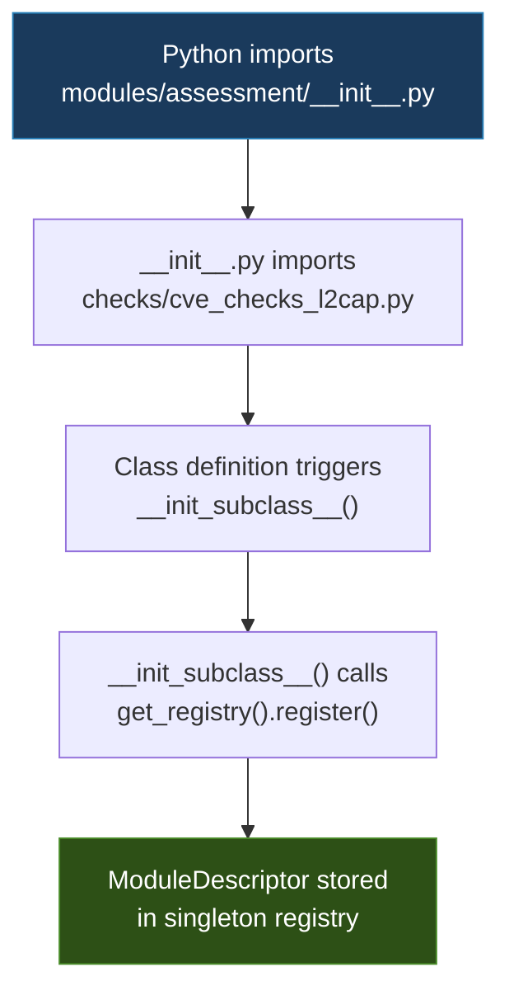

# Module System

This document covers the module registry, descriptors, families, and canonical import paths.

---

## ModuleRegistry

The registry is a singleton accessed via `get_registry()`. It stores all registered `ModuleDescriptor` instances and provides lookup and query methods.

```python
from blue_tap.framework.registry import get_registry

registry = get_registry()
```

### Methods

#### `register(descriptor)` -> `None`

Register a module. Raises `ValueError` on duplicate `module_id`.

```python
from blue_tap.framework.registry import get_registry, ModuleDescriptor, ModuleFamily

registry = get_registry()
registry.register(ModuleDescriptor(
    module_id="assessment.my_check",
    family=ModuleFamily.ASSESSMENT,
    name="My Check",
    description="Example check",
    protocols=("Classic",),
    requires=("adapter", "classic_target"),
    destructive=False,
    requires_pairing=False,
    schema_prefix="blue_tap.my_check.result",
    has_report_adapter=False,
    entry_point="blue_tap.modules.assessment.my_check:MyCheckModule",
))
```

#### `get(module_id)` -> `ModuleDescriptor`

Lookup by ID. Raises `KeyError` if not found.

```python
desc = registry.get("assessment.vuln_scanner")
print(desc.name)          # "Vulnerability Scanner"
print(desc.entry_point)   # "blue_tap.modules.assessment.vuln_scanner:VulnScannerModule"
print(desc.destructive)   # False
```

#### `try_get(module_id)` -> `ModuleDescriptor | None`

Lookup by ID. Returns `None` if not found. Use this when you're not sure the module exists.

```python
desc = registry.try_get("assessment.nonexistent")
if desc is None:
    print("Module not found")
```

#### `list_all()` -> `list[ModuleDescriptor]`

All modules sorted by `module_id`.

```python
all_modules = registry.list_all()
print(f"Total modules: {len(all_modules)}")
for m in all_modules[:5]:
    print(f"  {m.module_id}: {m.name}")
```

#### `list_family(family)` -> `list[ModuleDescriptor]`

All modules in a family, sorted.

```python
from blue_tap.framework.registry import ModuleFamily

assessment_modules = registry.list_family(ModuleFamily.ASSESSMENT)
print(f"Assessment modules: {len(assessment_modules)}")
for m in assessment_modules:
    print(f"  {m.module_id}: {m.name} ({'destructive' if m.destructive else 'safe'})")
```

#### `list_families()` -> `list[ModuleFamily]`

All families that have registered modules.

```python
families = registry.list_families()
for fam in families:
    count = len(registry.list_family(fam))
    print(f"  {fam.value}: {count} modules")
```

#### `find_by_protocol(protocol)` -> `list[ModuleDescriptor]`

Modules supporting a given protocol string.

```python
ble_modules = registry.find_by_protocol("BLE")
print(f"BLE-capable modules: {len(ble_modules)}")
for m in ble_modules:
    print(f"  {m.module_id}: protocols={m.protocols}")
```

#### `find_destructive()` -> `list[ModuleDescriptor]`

All modules where `destructive=True`.

```python
dangerous = registry.find_destructive()
print(f"Destructive modules: {len(dangerous)}")
for m in dangerous:
    print(f"  {m.module_id}: {m.name}")
```

#### `load_plugins()` -> `list[str]`

Load entry-point plugins; returns list of registered `module_id`s. See [Plugin Entry Points](plugin-entry-points.md) for details.

```python
loaded = registry.load_plugins()
print(f"Loaded {len(loaded)} plugin(s): {loaded}")
```

---

## ModuleDescriptor

A frozen dataclass that captures all metadata about a module. Defined in `blue_tap.framework.registry.descriptors`.

### Fields

| Field | Type | Required | Default | Description |
|---|---|---|---|---|
| `module_id` | `str` | Yes | | Format: `<family>.<name>`, regex: `^[a-z0-9_]+\.[a-z0-9_]+$` |
| `family` | `ModuleFamily` | Yes | | Enum value (see below) |
| `name` | `str` | Yes | | Human-readable name (must be non-empty) |
| `description` | `str` | Yes | | One-line purpose |
| `protocols` | `tuple[str, ...]` | Yes | | e.g. `("Classic", "BLE", "L2CAP")` |
| `requires` | `tuple[str, ...]` | Yes | | e.g. `("adapter", "classic_target")` |
| `destructive` | `bool` | Yes | | Whether the module modifies target state |
| `requires_pairing` | `bool` | Yes | | Whether pairing is mandatory |
| `schema_prefix` | `str` | Yes | | e.g. `"blue_tap.vulnscan.result"` |
| `has_report_adapter` | `bool` | Yes | | Whether a report adapter exists for this module |
| `entry_point` | `str` | Yes | | e.g. `"blue_tap.modules.assessment.vuln_scanner:VulnScannerModule"` |
| `internal` | `bool` | No | `False` | Internal-only flag (hidden from external API) |
| `report_adapter_path` | `str \| None` | No | `None` | Dotted path to a plugin `ReportAdapter` class, e.g. `"my_plugin.adapters:MyAdapter"` |
| `category` | `str \| None` | No | `None` | Sub-category within a family (e.g. `"pairing"`, `"l2cap"`, `"ble"`) |
| `references` | `tuple[str, ...]` | No | `()` | External references (CVEs, RFCs, specifications) |

### Validation (`__post_init__`)

The descriptor validates itself on construction:

1. `module_id` must match `^[a-z0-9_]+\.[a-z0-9_]+$`
2. `family` must be a `ModuleFamily` enum instance
3. `module_id` must start with `{family.value}.`
4. `name` must be non-empty
5. `protocols` must be a `tuple`
6. `requires` must be a `tuple`

Any violation raises `ValueError` immediately.

---

## ModuleFamily

An enum in `blue_tap.framework.registry.families`:

```python
class ModuleFamily(str, Enum):
    DISCOVERY = "discovery"
    RECONNAISSANCE = "reconnaissance"
    ASSESSMENT = "assessment"
    EXPLOITATION = "exploitation"
    POST_EXPLOITATION = "post_exploitation"
    FUZZING = "fuzzing"
```

### Canonical Outcomes per Family

Defined in `FAMILY_OUTCOMES` (the strict set from the architecture rule):

| Family | Canonical Outcomes |
|---|---|
| `DISCOVERY` | `observed`, `merged`, `correlated`, `partial`, `not_applicable` |
| `RECONNAISSANCE` | `observed`, `merged`, `correlated`, `partial`, `not_applicable` |
| `ASSESSMENT` | `confirmed`, `inconclusive`, `pairing_required`, `not_applicable` |
| `EXPLOITATION` | `success`, `unresponsive`, `recovered`, `not_applicable`, `aborted` |
| `POST_EXPLOITATION` | `extracted`, `connected`, `streamed`, `transferred`, `not_applicable` |
| `FUZZING` | `crash_found`, `timeout`, `corpus_grown`, `no_findings` |

The runtime validation in `result_schema.py` uses a broader `VALID_OUTCOMES_BY_FAMILY` dict that includes legacy/specialized outcomes. New modules should stick to the canonical set above.

---

## Registration Methods

### 1. Explicit Registration in `__init__.py`

The standard approach. Each family's `__init__.py` registers descriptors at import time:

```python
from blue_tap.framework.registry import get_registry, ModuleDescriptor, ModuleFamily

_registry = get_registry()

_registry.register(ModuleDescriptor(
    module_id="assessment.vuln_scanner",
    family=ModuleFamily.ASSESSMENT,
    name="Vulnerability Scanner",
    description="CVE and non-CVE vulnerability assessment with structured evidence",
    protocols=("Classic", "BLE", "L2CAP", "SDP", "GATT", "RFCOMM", "BNEP", "HID", "SMP"),
    requires=("adapter", "classic_target"),
    destructive=False,
    requires_pairing=False,
    schema_prefix="blue_tap.vulnscan.result",
    has_report_adapter=True,
    entry_point="blue_tap.modules.assessment.vuln_scanner:VulnScannerModule",
))
```

### 2. Auto-registration via `Module.__init_subclass__()`

Assessment check files (in `modules/assessment/checks/`) use `Module` subclasses that auto-register on class creation. The parent `__init__.py` imports these modules to trigger registration.

The flow works like this:



This means that simply importing the family package registers all its modules. No explicit `register()` call is needed in the check file itself.

### 3. Plugin Discovery via Entry Points

Third-party packages register modules via `setuptools` entry points. See [Plugin Entry Points](plugin-entry-points.md).

---

## Canonical Import Paths

| What you need | Import from |
|---|---|
| `RunEnvelope`, `ExecutionRecord`, `EvidenceRecord`, `ArtifactRef` | `blue_tap.framework.contracts.result_schema` |
| `build_run_envelope`, `make_execution`, `make_evidence`, `make_artifact` | `blue_tap.framework.contracts.result_schema` |
| `emit_cli_event` | `blue_tap.framework.runtime.cli_events` |
| `ReportAdapter`, `SectionModel`, `SectionBlock` | `blue_tap.framework.contracts.report_contract` |
| Envelope builders (`build_attack_result`, etc.) | `blue_tap.framework.envelopes.<family>` or `blue_tap.framework.envelopes` |
| `ModuleDescriptor`, `ModuleFamily`, `get_registry` | `blue_tap.framework.registry` |
| `FAMILY_OUTCOMES` | `blue_tap.framework.registry` |
| Report adapters | `blue_tap.framework.reporting.adapters` |
| `BlockRendererRegistry` | `blue_tap.framework.reporting.renderers.registry` |
| `Session`, `log_command`, `get_session` | `blue_tap.framework.sessions.store` |
| Hardware primitives | `blue_tap.hardware.<module>` |
| Module implementations | `blue_tap.modules.<family>.<module>` |
| Report generator | `blue_tap.interfaces.reporting.generator` |

!!! warning "Deprecated Paths"
    Never import from `core/`, `attack/`, `recon/`, `fuzz/`, or `report/`. These packages contain only deprecation notices.

---

## Available Envelope Builders

Each family has specialized builders in `blue_tap.framework.envelopes`:

| Builder | Family | Import |
|---|---|---|
| `build_scan_result` | discovery | `blue_tap.framework.envelopes.scan` |
| `build_recon_result`, `build_recon_execution` | reconnaissance | `blue_tap.framework.envelopes.recon` |
| `build_attack_result` | exploitation | `blue_tap.framework.envelopes.attack` |
| `build_audio_result` | post_exploitation | `blue_tap.framework.envelopes.audio` |
| `build_data_result` | post_exploitation | `blue_tap.framework.envelopes.data` |
| `build_fuzz_result`, `build_fuzz_campaign_result` | fuzzing | `blue_tap.framework.envelopes.fuzz` |
| `build_firmware_status_result`, `build_firmware_dump_result` | firmware ops | `blue_tap.framework.envelopes.firmware` |
| `build_spoof_result` | spoof ops | `blue_tap.framework.envelopes.spoof` |

All builders return a `dict` matching the `RunEnvelope` shape. They handle run ID generation, timestamps, and evidence/execution construction internally.
