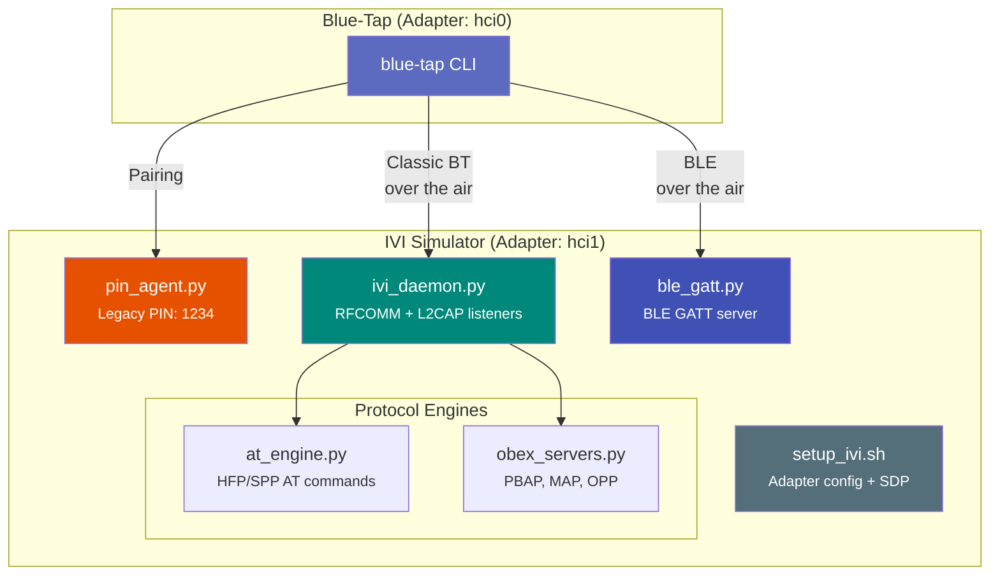

# IVI Simulator

!!! warning "Work in Progress"
    The IVI Simulator is currently broken and under active development. Expect incomplete functionality and potential issues. This page documents the intended design.

The Vulnerable IVI Simulator is an intentionally insecure Bluetooth car head unit
that ships in the `target/` directory. It creates a real Bluetooth target (not a mock)
on any Linux machine, behaving like a car infotainment system with known vulnerabilities
for safe, repeatable testing.

Unlike demo mode, which uses simulated data, the IVI simulator creates a live Bluetooth
device that responds to real over-the-air connections. Blue-Tap's discovery, reconnaissance,
exploitation, and data extraction modules all interact with it exactly as they would with
a real car head unit -- making it the ideal training and validation environment.

---

## Purpose

- Practice Blue-Tap commands against a real Bluetooth target without needing a vehicle
- Demonstrate all attack vectors in a controlled environment where mistakes have no consequences
- Validate tool functionality after installation or updates
- Train operators on the full Bluetooth assessment workflow before field engagements
- Develop and test new Blue-Tap modules against a known-good target

---

## Requirements

### Hardware

- **2 Bluetooth adapters** -- one for the IVI simulator, one for Blue-Tap (can be on the same machine using two USB dongles), OR
- **1 adapter + 1 phone** -- run the IVI on a Linux machine, attack from a phone or second machine
- Any adapter supporting Classic Bluetooth (CSR 8510, Intel, Broadcom, RTL8761B)

!!! tip "Same-Machine Two-Adapter Setup"
    The most convenient setup uses two USB Bluetooth dongles on the same laptop. One
    runs the IVI simulator (e.g., `hci1`), the other runs Blue-Tap (e.g., `hci0`).
    This way you only need a single machine for the entire training environment.
    See [Hardware Setup -- Two-Adapter Setup](hardware-setup.md#optional-two-adapter-setup)
    for adapter recommendations.

### Software

- Linux (Kali, Ubuntu 22.04+, Raspberry Pi OS)
- Python 3.10+
- BlueZ 5.x with compatibility mode enabled for `sdptool`

### Platform Notes

| Platform | Notes |
|----------|-------|
| Kali Linux | All tools pre-installed, recommended |
| Ubuntu / Debian | Install `bluez`, `bluez-tools`; enable compat mode |
| Raspberry Pi | Built-in BT adapter works; install `bluez` |

---

## Architecture

The IVI simulator consists of four processes that together emulate a car infotainment system's Bluetooth stack. The setup script configures the adapter identity and SDP records, the PIN agent handles pairing, the IVI daemon listens for connections on multiple channels, and the optional BLE GATT server exposes BLE services.



### Components

| Component | File | Role |
|-----------|------|------|
| Setup script | `setup_ivi.sh` | Configures adapter name, class, SDP records, pairing mode |
| IVI daemon | `ivi_daemon.py` | Listens on RFCOMM channels and L2CAP PSMs, dispatches connections to protocol engines |
| PIN agent | `pin_agent.py` | Responds to pairing requests with legacy PIN "1234" |
| BLE GATT server | `ble_gatt.py` | Exposes Device Info, Battery, and custom IVI BLE services |
| Configuration | `ivi_config.py` | Shared constants: channel map, UUIDs, device identity, protocol constants |
| OBEX engines | `obex_servers.py` | PBAP, MAP, OPP protocol handlers serving fake contacts, messages, and file push |
| AT engine | `at_engine.py` | HFP and SPP AT command responder returning fake IMEI, IMSI, battery, signal strength |
| Data generator | `obex_servers.py` | Generates fake contacts, messages, call history for PBAP/MAP |

### Default Identity

The simulator presents itself as a Ford SYNC head unit by default:

| Property | Value | Why This Matters |
|----------|-------|-----------------|
| Device name | SYNC | Common IVI name that triggers automatic pairing on many phones |
| Device class | `0x200408` (Audio/Video: Car Audio) | Identifies the device as a car audio system in Bluetooth discovery |
| Default PIN | 1234 | Deliberately weak -- the most common legacy Bluetooth PIN |
| Pre-paired phone | AA:BB:CC:DD:EE:FF ("Galaxy S24") | Simulates a phone that was previously paired to the IVI |

---

## Installation

### System Dependencies

=== "Kali Linux"

    ```bash
    sudo apt install -y bluez bluez-tools python3 python3-dbus python3-gi
    ```

=== "Debian / Ubuntu"

    ```bash
    sudo apt install -y bluez bluez-tools python3 python3-dbus python3-gi
    ```

=== "Raspberry Pi OS"

    ```bash
    sudo apt install -y bluez python3 python3-dbus python3-gi
    ```

### Enable BlueZ Compatibility Mode

`sdptool` requires the BlueZ compatibility plugin to register SDP service records. Without it, the IVI simulator cannot advertise its services and Blue-Tap's SDP enumeration will find nothing.

```bash
sudo sed -i 's|ExecStart=/usr/lib/bluetooth/bluetoothd|ExecStart=/usr/lib/bluetooth/bluetoothd --compat|' \
    /lib/systemd/system/bluetooth.service
sudo systemctl daemon-reload
sudo systemctl restart bluetooth
```

Verify compatibility mode is active:

```bash
$ sdptool browse local
```

??? example "Expected output (abbreviated)"

    ```
    Browsing FF:FF:FF:00:00:00 ...
    Service Name: Headset Gateway
    Service RecHandle: 0x10001
    ...
    ```

If this returns service records instead of an error like `Failed to connect to SDP server`, compatibility mode is active.

!!! warning "Compatibility Mode Security Note"
    The `--compat` flag enables the legacy SDP server interface, which is disabled by
    default in modern BlueZ because it allows any local process to register SDP records.
    This is fine for a test environment but should not be left enabled on production
    systems.

### Generate Test Data

The simulator includes pre-generated test data in `target/data/`. To regenerate
or customize:

```bash
cd target/
python3 -c "from obex_servers import generate_test_data; generate_test_data()"
```

This creates vCard contacts (50 entries), SMS messages (20 entries), and call history entries used by the PBAP and MAP services. The generated data uses realistic but fake names, numbers, and content.

---

## Quick Start

The simulator requires three components running in separate terminals (four if using BLE). All must run as root.

=== "Terminal 1: Setup"

    Configure the adapter identity and register SDP service records:

    ```bash
    $ cd target/
    $ sudo ./setup_ivi.sh
    [*] Using adapter: hci1
    [*] Setting device name: SYNC
    [*] Setting device class: 0x200408 (Car Audio)
    [*] Registering SDP services...
        SPP (RFCOMM 1) .................. registered
        Hidden Debug (RFCOMM 2) ......... registered (no SDP)
        OPP (RFCOMM 9) .................. registered
        HFP (RFCOMM 10) ................. registered
        PBAP (RFCOMM 15) ................ registered
        MAP (RFCOMM 16) ................. registered
    [*] Setting pairing mode: auto (legacy PIN)
    [*] Adding pre-paired device: AA:BB:CC:DD:EE:FF (Galaxy S24)
    [+] IVI adapter configured. Start pin_agent.py and ivi_daemon.py next.
    ```

=== "Terminal 2: PIN Agent"

    Start the pairing agent that responds to pairing requests with PIN "1234":

    ```bash
    $ cd target/
    $ sudo python3 pin_agent.py
    [*] PIN Agent started
    [*] Waiting for pairing requests...
    [*] Default PIN: 1234
    ```

    When a device pairs, you will see:

    ```
    [*] Pairing request from 11:22:33:44:55:66
    [*] Responding with PIN: 1234
    [+] Pairing complete: 11:22:33:44:55:66
    ```

=== "Terminal 3: IVI Daemon"

    Start the main IVI daemon that listens for connections:

    ```bash
    $ cd target/
    $ sudo python3 ivi_daemon.py
    [*] IVI Daemon started on hci1 (SYNC)
    [*] Listening on:
        RFCOMM  1  (SPP) ............... ready
        RFCOMM  2  (Hidden Debug) ...... ready
        RFCOMM  9  (OPP) ............... ready
        RFCOMM 10  (HFP) ............... ready
        RFCOMM 15  (PBAP) .............. ready
        RFCOMM 16  (MAP) ............... ready
        L2CAP   7  (BNEP) .............. ready
        L2CAP  23  (AVCTP) ............. ready
        L2CAP  25  (AVDTP) ............. ready
    [*] Waiting for connections...
    ```

=== "Terminal 4: BLE (Optional)"

    Start the BLE GATT server for BLE testing:

    ```bash
    $ cd target/
    $ sudo python3 ble_gatt.py
    [*] BLE GATT Server started on hci1
    [*] Advertising: SYNC-LE
    [*] Services:
        Device Information (0x180A) ..... active
        Battery (0x180F) ................ active
        Custom IVI (12345678-...) ....... active
    [*] Waiting for BLE connections...
    ```

To stop the simulator:

```bash
# Ctrl+C in each terminal, then reset adapter config
cd target/
sudo ./setup_ivi.sh reset
```

---

## Exposed Services

The IVI simulator exposes a realistic set of Bluetooth services that mirror what you would find on an actual car head unit. Each service is deliberately configured with security weaknesses to create a comprehensive practice target.

### Classic Bluetooth (RFCOMM + L2CAP)

| Service | Protocol | Channel/PSM | What It Does | Why It's Vulnerable |
|---------|----------|-------------|--------------|---------------------|
| SPP (Serial Port) | RFCOMM | 1 | AT command responder | Accepts connections without authentication; returns device identifiers (IMEI, IMSI) via AT commands |
| Hidden Debug | RFCOMM | 2 | Not registered in SDP | Channel exists but is not advertised -- tests whether the assessment tool probes beyond SDP |
| OPP (Object Push) | RFCOMM | 9 | Accepts any file | No authentication, no file type filtering -- any file can be pushed to the IVI |
| HFP (Hands-Free) | RFCOMM | 10 | Full SLC handshake, AT command set | Full hands-free profile with AT command access, enabling call control and device information extraction |
| PBAP (Phonebook) | RFCOMM | 15 | 50 contacts, call history (OBEX) | Phonebook exposed without authentication -- contacts, call logs, and favorites are freely accessible |
| MAP (Messages) | RFCOMM | 16 | 20 SMS messages (OBEX) | Message store exposed without authentication -- full SMS content, timestamps, and phone numbers |
| BNEP (PAN) | L2CAP | 7 | Fuzz absorber | Accepts and logs malformed BNEP packets without crashing -- tests fuzzer stability |
| AVCTP (AVRCP) | L2CAP | 23 | Fuzz absorber | Accepts and logs malformed AVCTP packets |
| AVDTP (A2DP) | L2CAP | 25 | Fuzz absorber | Accepts and logs malformed AVDTP packets |

### BLE (GATT)

| Service | UUID | Characteristics | Vulnerability |
|---------|------|-----------------|---------------|
| Device Information | `0x180A` | Manufacturer, Model, Firmware Rev, Software Rev, PnP ID | Exposes detailed firmware version information useful for fingerprinting |
| Battery | `0x180F` | Battery Level (read/notify) | None (informational) |
| Custom IVI | `12345678-...` | Vehicle Speed (read), Diag Data (read), OTA Update (write, no auth) | OTA Update characteristic is writable without authentication -- could allow firmware injection |

---

## Built-in Vulnerabilities

Each vulnerability below maps to a specific Blue-Tap command that detects or exploits it. This makes the simulator a practical training tool: run the command, observe the finding, understand why it matters.

| Vulnerability | Severity | How Blue-Tap Finds It | Real-World Impact |
|---------------|----------|----------------------|-------------------|
| Legacy PIN pairing ("1234") | HIGH | `blue-tap exploit pin-brute` | Attacker can pair to the IVI by brute-forcing the 4-digit PIN (10,000 combinations, often under 30 seconds) |
| Unauthenticated OBEX (PBAP/MAP/OPP) | CRITICAL | `blue-tap vulnscan` | Contacts, messages, and call history can be extracted without pairing -- the most common real-world IVI vulnerability |
| Just Works pairing (SSP mode) | HIGH | `blue-tap vulnscan` | SSP with "Just Works" association requires no user confirmation on many devices, enabling silent pairing |
| No PIN rate limiting | MEDIUM | `blue-tap vulnscan` | No lockout after failed PIN attempts, making brute force trivially fast |
| Hidden RFCOMM channel (ch 2) | MEDIUM | `blue-tap vulnscan` | Debug interface accessible but not advertised in SDP -- missed by tools that only check SDP records |
| Permissive AT commands | MEDIUM | `blue-tap extract at` | AT commands return IMEI, IMSI, and subscriber info -- device identity information useful for tracking |
| Writable BLE GATT (OTA, no auth) | HIGH | `blue-tap recon gatt` | Unauthenticated write access to OTA update characteristic could allow firmware modification |
| Hijack-vulnerable bond | CRITICAL | `blue-tap exploit hijack` | Bond can be stolen by spoofing a previously-paired device's MAC address |
| No encryption enforcement | HIGH | `blue-tap vulnscan` | Services accept unencrypted connections, enabling passive eavesdropping |

---

## Testing Workflows

### Discovery and Reconnaissance

```bash
# Discover the IVI
$ sudo blue-tap discover classic --hci hci0
# Look for "SYNC" with class "Car Audio"

# Full SDP enumeration
$ sudo blue-tap recon <IVI_MAC> sdp
# Expect: 7 registered services + 1 hidden channel

# BLE GATT enumeration (if ble_gatt.py running)
$ sudo blue-tap recon <IVI_MAC> gatt
# Expect: 3 GATT services including writable OTA characteristic
```

### Vulnerability Scanning

```bash
$ sudo blue-tap vulnscan <IVI_MAC>
```

Runs all assessment checks. Expect findings for unauthenticated OBEX, weak pairing,
hidden channels, and missing encryption. The IVI simulator is designed to produce
at least 9 findings (2 CRITICAL, 4 HIGH, 3 MEDIUM) on a clean scan.

### Data Extraction

```bash
# Pull phonebook (PBAP) -- expect 50 contacts
$ sudo blue-tap extract <IVI_MAC> contacts

# Pull messages (MAP) -- expect 20 SMS messages
$ sudo blue-tap extract <IVI_MAC> messages

# Push a file (OPP) -- IVI accepts anything
$ sudo blue-tap extract <IVI_MAC> push --file test.vcf
```

!!! note "Data Extraction Without Pairing"
    On the IVI simulator, PBAP, MAP, and OPP all work without pairing. This mirrors
    real-world IVI vulnerabilities where OBEX services are exposed without authentication.
    In a real engagement, this is typically a CRITICAL finding.

### HFP / AT Commands

```bash
# Connect to HFP and run AT commands
$ sudo blue-tap extract <IVI_MAC> at
```

The SPP channel (1) and HFP channel (10) both respond to AT commands. The AT engine
returns fake IMEI, IMSI, battery, signal strength, operator, and subscriber number.

??? example "AT command session example"

    ```
    [*] Connected to HFP on RFCOMM channel 10
    AT+CGSN
    +CGSN: 358240051111110
    OK
    AT+CIMI
    +CIMI: 310260000000000
    OK
    AT+CBC
    +CBC: 0,87
    OK
    AT+CSQ
    +CSQ: 24,99
    OK
    ```

### PIN Brute Force

```bash
$ sudo blue-tap exploit <IVI_MAC> pin-brute
```

The IVI uses legacy PIN "1234" with no rate limiting. Expect the brute force to succeed within a few seconds.

### Fuzzing

```bash
# SDP deep fuzz
$ sudo blue-tap fuzz <IVI_MAC> sdp-deep

# L2CAP signaling fuzz
$ sudo blue-tap fuzz <IVI_MAC> l2cap-sig

# RFCOMM raw fuzz
$ sudo blue-tap fuzz <IVI_MAC> rfcomm-raw
```

The L2CAP PSM listeners (BNEP, AVCTP, AVDTP) act as fuzz absorbers -- they accept
and log malformed data without crashing. This tests your fuzzer's stability and
packet generation without risk of losing the target. The IVI daemon logs all
received fuzz packets to stdout, so you can verify what the target actually received.

### Connection Hijack

```bash
$ sudo blue-tap exploit <IVI_MAC> hijack
```

The IVI's bonding configuration is intentionally vulnerable to hijack attacks. This
requires MAC spoofing capability on your attacking adapter -- see
[Hardware Setup -- MAC Address Spoofing](hardware-setup.md#mac-address-spoofing).

---

## Configuration

### Changing IVI Name and Class

Edit `target/ivi_config.py`:

```python
IVI_NAME = "SYNC"                  # Change to any name
IVI_DEVICE_CLASS = 0x200408        # Audio/Video: Car Audio
```

Or pass arguments to the setup script:

```bash
# Custom profile and phone MAC
sudo ./setup_ivi.sh legacy AA:BB:CC:DD:EE:FF

# Custom adapter
sudo ./setup_ivi.sh auto AA:BB:CC:DD:EE:FF hci1
```

### Setup Profiles

The setup script supports multiple profiles that configure different pairing behaviors. This lets you test Blue-Tap against various pairing configurations without editing config files.

| Profile | Command | Pairing Behavior | Attack Surface |
|---------|---------|-----------------|----------------|
| `auto` | `sudo ./setup_ivi.sh` | Auto-detect best profile | Tests both legacy and SSP depending on adapter capabilities |
| `legacy` | `sudo ./setup_ivi.sh legacy` | Force legacy PIN mode | PIN brute force, no SSP protections |
| `ssp` | `sudo ./setup_ivi.sh ssp` | Force SSP / Just Works | Just Works pairing with no user confirmation |
| `detect` | `sudo ./setup_ivi.sh detect` | Dry-run diagnostics only | No changes -- reports what would be configured |
| `reset` | `sudo ./setup_ivi.sh reset` | Undo all adapter changes | Restores adapter to default state |

### Changing the PIN

Edit `target/ivi_config.py`:

```python
DEFAULT_PIN = "1234"
```

The PIN agent (`pin_agent.py`) reads this value at startup. You can change it to test Blue-Tap's brute force against different PIN values -- for example, set it to "9999" to verify the brute force covers the full keyspace.

### Changing the Pre-Paired Phone MAC

```bash
# Via setup script argument
sudo ./setup_ivi.sh auto BB:CC:DD:EE:FF:00

# Or edit ivi_config.py
DEFAULT_PHONE_MAC = "BB:CC:DD:EE:FF:00"
```

The pre-paired MAC matters for connection hijack testing: Blue-Tap's hijack module
spoofs this address to steal the bond.

### Test Data Size

Regenerate with custom counts by editing `obex_servers.py` generation parameters
or modifying the vCard/message files in `target/data/` directly.

### Adapter Selection

```bash
# Use hci1 instead of default hci0
sudo ./setup_ivi.sh auto AA:BB:CC:DD:EE:FF hci1
sudo python3 ivi_daemon.py --hci hci1
sudo python3 ble_gatt.py --hci hci1
```

---

## Troubleshooting

### Adapter not found

```
[x] No adapter found at hci0
```

**Cause:** The specified HCI adapter does not exist or is not recognized by BlueZ.

**Fix:**

```bash
# List available adapters
hciconfig -a

# If adapter exists but is DOWN
sudo hciconfig hci0 up

# If USB adapter not detected, check dmesg
dmesg | tail -20
```

### SDP registration failed

```
Failed to register service record
```

**Cause:** BlueZ compatibility mode is not enabled. `sdptool` requires the `--compat` flag on `bluetoothd`.

**Fix:**

```bash
sudo sed -i 's|ExecStart=/usr/lib/bluetooth/bluetoothd|ExecStart=/usr/lib/bluetooth/bluetoothd --compat|' \
    /lib/systemd/system/bluetooth.service
sudo systemctl daemon-reload
sudo systemctl restart bluetooth
```

### L2CAP PSM bind error

```
OSError: [Errno 98] Address already in use
```

**Cause:** Another process (often `bluetoothd`) already holds the PSM.

**Fix:**

```bash
# Check what is using the PSM
sudo ss -tlnp | grep bluetooth

# Restart bluetoothd to release PSMs
sudo systemctl restart bluetooth

# Then start the IVI daemon again
sudo python3 ivi_daemon.py
```

### SSP cannot be disabled

On some kernels and BlueZ versions, disabling SSP (Secure Simple Pairing) to force
legacy PIN mode is not supported at the management API level.

**Symptoms:** `setup_ivi.sh legacy` completes but the adapter still uses SSP.

**Fix:**

```bash
# Check current SSP state
sudo btmgmt info

# If SSP cannot be disabled, use the ssp profile instead
sudo ./setup_ivi.sh ssp
```

The `ssp` profile configures Just Works pairing, which is also a valid attack surface
(no user confirmation required on many devices).

### IVI not visible during discovery

**Symptoms:** Blue-Tap's `discover classic` does not find the IVI.

**Fix:**

```bash
# Verify the IVI adapter is UP and PSCAN-enabled (page scan = discoverable)
sudo hciconfig hci1
# Look for "UP RUNNING PSCAN" in the output

# If PSCAN is missing
sudo hciconfig hci1 piscan

# Verify from a different tool
bluetoothctl scan on
```

!!! tip "Separate Adapters"
    If Blue-Tap and the IVI simulator are on the same machine, they must use different
    adapters. A single adapter cannot simultaneously act as both the scanner and the
    target. Use `--hci hci0` for Blue-Tap and `hci1` for the IVI (or vice versa).

---

## What's Next?

- **[Quick Start](quick-start.md)** -- run the standard assessment workflow against the IVI simulator
- **[Full Penetration Test](../workflows/full-pentest.md)** -- end-to-end workflow including exploitation and post-exploitation
- **[Fuzzing Campaign](../workflows/fuzzing-campaign.md)** -- use the IVI's fuzz absorbers for protocol fuzzing practice
- **[Troubleshooting](../reference/troubleshooting.md)** -- general Blue-Tap troubleshooting guide
