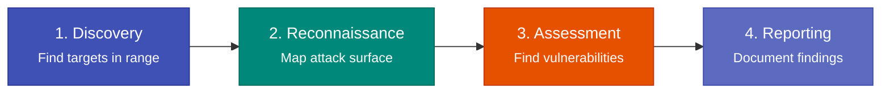

# Quick Start

This walkthrough covers the core Blue-Tap assessment workflow in five steps:
discover nearby targets, enumerate services, scan for vulnerabilities, generate
a report, and try demo mode. By the end, you will have completed a basic Bluetooth
security assessment and produced a professional report.

!!! warning "Root Required"
    All Bluetooth operations require root privileges because Blue-Tap opens raw HCI
    sockets and calls privileged BlueZ management APIs. Run commands with `sudo`
    or from a root shell.

!!! tip "No Hardware? Start with Demo Mode"
    If you do not have a Bluetooth adapter or a target device yet, skip to
    [Step 5: Demo Mode](#step-5-demo-mode) to explore the full assessment workflow
    using simulated data. You can also set up the [IVI Simulator](ivi-simulator.md)
    for a real-over-the-air practice target.

---

## Step 1: Discover Targets

The first phase of any Bluetooth assessment is discovering what devices are in range. Blue-Tap supports Classic Bluetooth inquiry scanning, BLE active scanning, and a combined mode.

```bash
sudo blue-tap discover classic
```

This performs a Classic Bluetooth inquiry scan (typically 10-15 seconds) and displays discovered devices in a table.

??? example "Example output"

    ```
    Classic Bluetooth Discovery
    ===========================

    Scanning for nearby Classic Bluetooth devices...

    ┌────────────────────┬──────────────────┬───────────────┬──────┬──────────────────┐
    │ MAC Address        │ Device Name      │ Device Class  │ RSSI │ Manufacturer     │
    ├────────────────────┼──────────────────┼───────────────┼──────┼──────────────────┤
    │ DE:AD:BE:EF:CA:FE  │ SYNC             │ Car Audio     │ -45  │ Texas Instrum.   │
    │ AA:BB:CC:11:22:33  │ Galaxy S24       │ Phone         │ -62  │ Samsung          │
    │ 44:55:66:77:88:99  │ AirPods Pro      │ Audio         │ -71  │ Apple Inc.       │
    └────────────────────┴──────────────────┴───────────────┴──────┴──────────────────┘

    Found 3 devices in 12.4 seconds.
    ```

**What to look for:** The MAC address of your target device. You will use it in all subsequent commands. The device class and name help confirm you have the right target -- car audio systems typically show class `0x200408` or similar Audio/Video classes.

For BLE targets:

```bash
sudo blue-tap discover ble
```

??? example "Example BLE output"

    ```
    BLE Discovery
    =============

    Scanning for nearby BLE devices...

    ┌────────────────────┬──────────────────┬──────────────────────────┬──────┐
    │ MAC Address        │ Device Name      │ Services                 │ RSSI │
    ├────────────────────┼──────────────────┼──────────────────────────┼──────┤
    │ DE:AD:BE:EF:CA:FE  │ SYNC-LE          │ Device Info, Battery     │ -48  │
    │ 11:22:33:44:55:66  │ Fitbit Charge 5  │ Heart Rate, Generic      │ -79  │
    └────────────────────┴──────────────────┴──────────────────────────┴──────┘

    Found 2 BLE devices in 8.2 seconds.
    ```

For both Classic and BLE in a single pass:

```bash
sudo blue-tap discover all
```

!!! note "Discovery Duration"
    Classic inquiry scanning takes 10-15 seconds by default. BLE scanning takes 8-10
    seconds. Some devices may not respond on the first scan -- run discovery twice if
    you suspect a target is nearby but was not detected.

---

## Step 2: Reconnaissance

Once you have a target MAC address, reconnaissance deep-enumerates its services and capabilities. This step reveals the target's attack surface -- which profiles it exposes, which RFCOMM channels are open, and whether any services are accessible without authentication.

```bash
sudo blue-tap recon DE:AD:BE:EF:CA:FE sdp
```

Replace `DE:AD:BE:EF:CA:FE` with your target's MAC address. This queries the target's SDP (Service Discovery Protocol) server and reports all registered services.

??? example "Example SDP output"

    ```
    SDP Service Enumeration: DE:AD:BE:EF:CA:FE
    ============================================

    ┌──────┬──────────────────────────────┬──────────┬──────────┬────────────┐
    │ #    │ Service Name                 │ Protocol │ Channel  │ Auth Req   │
    ├──────┼──────────────────────────────┼──────────┼──────────┼────────────┤
    │ 1    │ Serial Port (SPP)            │ RFCOMM   │ 1        │ None       │
    │ 2    │ Object Push (OPP)            │ RFCOMM   │ 9        │ None       │
    │ 3    │ Hands-Free Unit (HFP)        │ RFCOMM   │ 10       │ None       │
    │ 4    │ Phonebook Access (PBAP)      │ RFCOMM   │ 15       │ None       │
    │ 5    │ Message Access (MAP)         │ RFCOMM   │ 16       │ None       │
    │ 6    │ Audio Source (A2DP)          │ L2CAP    │ PSM 25   │ None       │
    │ 7    │ AV Remote Control (AVRCP)    │ L2CAP    │ PSM 23   │ None       │
    │ 8    │ PAN Network Access (BNEP)    │ L2CAP    │ PSM 7    │ None       │
    └──────┴──────────────────────────────┴──────────┴──────────┴────────────┘

    Found 8 SDP services on DE:AD:BE:EF:CA:FE
    Hidden channels detected: RFCOMM channel 2 (not in SDP)

    [!] WARNING: 5 services expose unauthenticated access
    ```

**What to look for:** Open RFCOMM channels, exposed profiles (PBAP, MAP, OPP, HFP, SPP), hidden channels not registered in SDP, and any services that should not be publicly accessible. Unauthenticated PBAP and MAP services are particularly concerning -- they allow phonebook and message extraction without pairing.

For BLE targets, enumerate GATT services instead:

```bash
sudo blue-tap recon DE:AD:BE:EF:CA:FE gatt
```

??? example "Example GATT output"

    ```
    GATT Service Enumeration: DE:AD:BE:EF:CA:FE
    =============================================

    Service: Device Information (0x180A)
    ├── Manufacturer Name (0x2A29) ... [READ] "Texas Instruments"
    ├── Model Number (0x2A24) ........ [READ] "SYNC 4.2"
    ├── Firmware Rev (0x2A26) ........ [READ] "2.1.0-build3847"
    └── PnP ID (0x2A50) ............. [READ] VID=0x000D PID=0x0001

    Service: Battery (0x180F)
    └── Battery Level (0x2A19) ....... [READ/NOTIFY] 87%

    Service: Custom IVI (12345678-...)
    ├── Vehicle Speed (custom) ....... [READ] 0 km/h
    ├── Diag Data (custom) ........... [READ] <82 bytes>
    └── OTA Update (custom) .......... [WRITE, NO AUTH]

    [!] WARNING: OTA Update characteristic is writable without authentication
    ```

---

## Step 3: Vulnerability Scan

With the target's attack surface mapped, run the full vulnerability assessment:

```bash
sudo blue-tap vulnscan DE:AD:BE:EF:CA:FE
```

This executes all registered assessment checks -- CVE detections, configuration audits, protocol compliance probes, and denial-of-service susceptibility tests. Each check produces a structured finding with severity level.

??? example "Example vulnscan output"

    ```
    Vulnerability Assessment: DE:AD:BE:EF:CA:FE (SYNC)
    ====================================================

    Running 51 assessment checks...

    ┌──────────┬────────────────────────────────────────┬──────────┬──────────────┐
    │ Severity │ Finding                                │ Protocol │ Status       │
    ├──────────┼────────────────────────────────────────┼──────────┼──────────────┤
    │ CRITICAL │ Unauthenticated PBAP access            │ OBEX     │ Confirmed    │
    │ CRITICAL │ Unauthenticated MAP access             │ OBEX     │ Confirmed    │
    │ HIGH     │ Legacy PIN pairing enabled             │ SDP/GAP  │ Confirmed    │
    │ HIGH     │ Just Works SSP (no user confirm)       │ SSP      │ Confirmed    │
    │ HIGH     │ No encryption enforcement              │ L2CAP    │ Confirmed    │
    │ HIGH     │ Writable BLE char without auth (OTA)   │ GATT     │ Confirmed    │
    │ MEDIUM   │ Hidden RFCOMM channel detected (ch 2)  │ RFCOMM   │ Confirmed    │
    │ MEDIUM   │ No PIN attempt rate limiting           │ GAP      │ Confirmed    │
    │ MEDIUM   │ Permissive AT command set              │ HFP/SPP  │ Confirmed    │
    │ LOW      │ Verbose SDP service names              │ SDP      │ Observed     │
    └──────────┴────────────────────────────────────────┴──────────┴──────────────┘

    Assessment complete: 10 findings (2 CRITICAL, 4 HIGH, 3 MEDIUM, 1 LOW)
    Duration: 47.3 seconds
    ```

**What to look for:** Critical and high-severity findings indicate exploitable vulnerabilities. Each finding includes a description, affected profile/protocol, and remediation guidance in the full report. The `Confirmed` status means the check positively verified the vulnerability; `Observed` means a condition was detected that indicates risk but was not directly exploitable.

---

## Step 4: Generate Report

Generate an HTML and JSON report from the current session:

```bash
sudo blue-tap report
```

??? example "Example output"

    ```
    Report Generation
    =================

    Session: default-20260416-143022
    Modules with results: 3 (discovery, recon, vulnscan)

    Generating HTML report... done
    Generating JSON export... done

    ╭─ Report Output ────────────────────────────────────────────╮
    │                                                             │
    │  HTML:  sessions/default-20260416-143022/report.html       │
    │  JSON:  sessions/default-20260416-143022/report.json       │
    │                                                             │
    ╰─────────────────────────────────────────────────────────────╯
    ```

This collects all results from the active session -- discovery, reconnaissance, vulnscan,
any exploits or extractions you ran -- and produces a structured report. The HTML report
is designed for inclusion in pentest deliverables; the JSON export is machine-readable
for integration with other tools.

**What to look for:** The report path printed at the end. Open the HTML file in a browser to review the full assessment with per-finding details, evidence, and remediation guidance.

!!! tip "Named Sessions"
    Use `-s` to name your session for easier organization. All commands in a named
    session share state, so the report aggregates everything:

    ```bash
    sudo blue-tap -s car-audit discover classic
    sudo blue-tap -s car-audit recon DE:AD:BE:EF:CA:FE sdp
    sudo blue-tap -s car-audit vulnscan DE:AD:BE:EF:CA:FE
    sudo blue-tap -s car-audit report
    ```

    Session data persists across Blue-Tap invocations, so you can pause and resume
    an assessment across multiple terminal sessions or even across days. See
    [Sessions & Reporting](../guide/sessions-and-reporting.md) for details.

---

## Step 5: Demo Mode

Run a full simulated pentest with mock data -- no Bluetooth hardware required:

```bash
blue-tap demo
```

??? example "Full demo output"

    ```
    ╭─ Blue-Tap Demo Assessment ─────────────────────────────────╮
    │                                                             │
    │  Target: SYNC (DE:AD:BE:EF:CA:FE)                         │
    │  Adapter: hci0 (simulated)                                  │
    │  Session: demo-20260416-143022                              │
    │                                                             │
    ╰─────────────────────────────────────────────────────────────╯

    Phase 1/9: Discovery ......................................... OK
      Found 4 Classic devices, 2 BLE devices

    Phase 2/9: Fingerprinting .................................... OK
      Target: SYNC -- Car Audio, Bluetooth 5.0, Texas Instruments

    Phase 3/9: Service Enumeration ............................... OK
      8 SDP services, 3 GATT services, 1 hidden channel

    Phase 4/9: RFCOMM / L2CAP Scanning ........................... OK
      9 open channels across RFCOMM and L2CAP

    Phase 5/9: Vulnerability Assessment .......................... OK
      2 CRITICAL, 4 HIGH, 3 MEDIUM, 1 LOW

    Phase 6/9: Exploitation Simulation ........................... OK
      PIN brute: success (PIN=1234, 3 attempts)
      Connection hijack: success

    Phase 7/9: Data Extraction ................................... OK
      50 contacts (PBAP), 20 messages (MAP), AT command access

    Phase 8/9: DoS Testing ....................................... OK
      3/5 DoS vectors caused target unresponsiveness

    Phase 9/9: Report Generation ................................. OK

    Report written to: demo_output/report.html
    JSON export:       demo_output/report.json

    Demo complete. 9/9 phases finished successfully.
    ```

Demo mode runs a 9-phase simulated assessment cycle using hardcoded realistic data. It exercises the full Rich terminal UI and generates a real HTML + JSON report identical in structure to a live assessment. This is useful for:

- Verifying your installation is working end-to-end
- Familiarizing yourself with the CLI output format before a real engagement
- Demonstrating Blue-Tap's capabilities without needing hardware or a target
- Generating a sample report to review the report structure

Output is written to `demo_output/` by default:

```bash
# Custom output directory
blue-tap demo -o ./my-demo/
```

!!! note "No Root Needed for Demo"
    Demo mode uses mock data only and does not interact with Bluetooth hardware.
    It can run without root and without a Bluetooth adapter.

---

## What You Just Did

The five steps above follow the standard Bluetooth penetration testing workflow:



| Step | What It Does | Why It Matters |
|------|-------------|----------------|
| **Discovery** | Identifies Bluetooth devices in radio range | You cannot test what you cannot see. Discovery establishes which targets exist and are reachable. |
| **Reconnaissance** | Enumerates services, profiles, and capabilities | Reveals the target's attack surface -- which protocols are exposed and whether they require authentication. |
| **Assessment** | Tests for known vulnerabilities (CVEs, misconfigurations) | Identifies exploitable weaknesses with severity classification and evidence. |
| **Reporting** | Aggregates all findings into HTML and JSON | Produces the deliverable for stakeholders, with per-finding details and remediation guidance. |

This quick start covers the passive and assessment phases. Blue-Tap also supports active exploitation (PIN brute force, connection hijacking, encryption downgrade), post-exploitation (data extraction, audio eavesdropping), and protocol fuzzing. See the workflows below for complete attack chains.

---

## What's Next?

- **[Hardware Setup](hardware-setup.md)** -- adapter management, MAC spoofing, DarkFirmware installation
- **[IVI Simulator](ivi-simulator.md)** -- set up a vulnerable practice target with known weaknesses
- **[Full Penetration Test Workflow](../workflows/full-pentest.md)** -- end-to-end assessment including exploitation and post-exploitation
- **[Quick Assessment Workflow](../workflows/quick-assessment.md)** -- streamlined workflow for time-constrained engagements
- **[Audio Eavesdropping Workflow](../workflows/audio-eavesdropping.md)** -- A2DP and HFP capture chains
- **[CLI Reference](../guide/cli-reference.md)** -- complete command reference for all Blue-Tap commands
