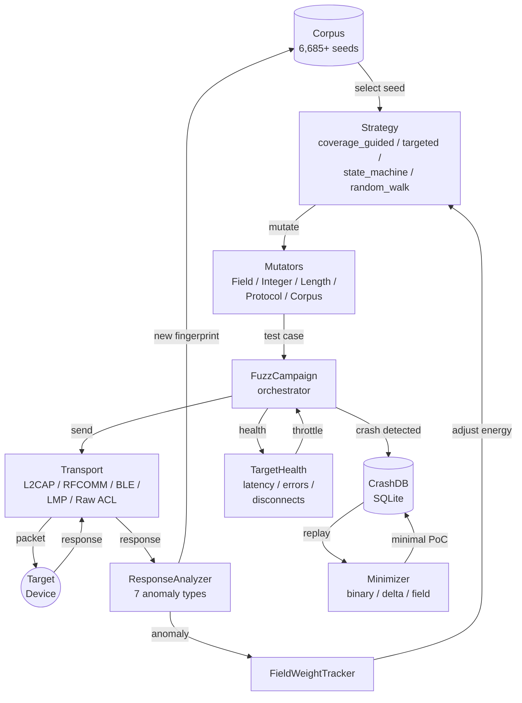

# Fuzzing

**Module:** `fuzzing` --- 15,280 lines of code

**Protocols:** 16 | **Strategies:** 4 | **Transports:** 5

**Outcomes:** `crash_found`, `timeout`, `corpus_grown`, `no_findings`

Protocol-aware Bluetooth fuzzer with crash database, payload minimization, CVE reproduction, and live dashboard.

---

## Why Bluetooth Fuzzing Is Different

Bluetooth fuzzing is fundamentally harder than web or network fuzzing, and the techniques that work for HTTP APIs or TCP services don't transfer directly.

**No source code, no instrumentation.** Web fuzzers like AFL and libFuzzer rely on compile-time instrumentation to measure code coverage. Bluetooth targets are closed-source firmware running on embedded chips. You cannot instrument them. Blue-Tap's `coverage_guided` strategy works around this by using *response fingerprinting* --- treating the target as a black box and inferring coverage from the diversity of responses.

**Hardware in the loop.** Every fuzzed packet must travel over a real Bluetooth radio to a real device. This imposes hard limits on throughput (hundreds of packets/sec, not millions) and means crashes are physical events --- the target device may need a manual reboot. The fuzzer must manage connection state, handle disconnections gracefully, and adapt its pacing to keep the target alive.

**Stateful protocols.** Bluetooth protocols are deeply stateful. An SDP query makes no sense without an L2CAP connection. An OBEX GET fails without a prior CONNECT. The fuzzer must understand protocol state machines to generate packets that reach deep code paths, not just bounce off the first validation check.

**No crash telemetry.** When a web server crashes, you get a stack trace. When a Bluetooth device crashes, it simply disappears from the radio spectrum. Blue-Tap detects crashes through absence: timeouts, connection drops, and the target vanishing from inquiry scans. The crash database deduplicates these events and the minimizer isolates the trigger.

---

## Architecture



**Engine** (`FuzzCampaign`) orchestrates fuzzing sessions. It pulls seeds from the **Corpus**, applies **Strategies** and **Mutators** to generate test cases, sends them via the appropriate **Transport**, analyzes responses with the **ResponseAnalyzer**, and records crashes in the **CrashDB**. The **Minimizer** reduces crash-triggering payloads to their essential bytes.

---

## Supported Protocols

| Protocol | Transport | PSM / Channel / CID |
|----------|-----------|---------------------|
| `sdp` | L2CAP | PSM 1 |
| `bnep` | L2CAP | PSM 15 |
| `rfcomm` | L2CAP | PSM 3 |
| `l2cap` | L2CAP | PSM 1 |
| `l2cap-sig` | Raw ACL | --- |
| `at-hfp` | RFCOMM | Channel 10 |
| `at-phonebook` | RFCOMM | Channel 1 |
| `at-sms` | RFCOMM | Channel 1 |
| `at-injection` | RFCOMM | Channel 1 |
| `obex-pbap` | RFCOMM | Channel 15 |
| `obex-map` | RFCOMM | Channel 16 |
| `obex-opp` | RFCOMM | Channel 9 |
| `ble-att` | BLE | CID 4 |
| `ble-smp` | BLE | CID 6 |
| `lmp` | LMP | --- |
| `raw-acl` | Raw ACL | --- |

---

## Transport Layer

Five transport implementations, all inheriting from `BluetoothTransport`:

| Transport | Protocols | Connection Method |
|-----------|-----------|-------------------|
| `L2CAPTransport` | sdp, bnep, rfcomm, l2cap | L2CAP socket with PSM |
| `RFCOMMTransport` | at-hfp, at-phonebook, at-sms, at-injection, obex-pbap, obex-map, obex-opp | RFCOMM socket with channel |
| `BLETransport` | ble-att, ble-smp | BLE connection with fixed CID |
| `LMPTransport` | lmp | LMP injection via DarkFirmware |
| `RawACLTransport` | l2cap-sig, raw-acl | Raw HCI ACL frames |

All transports share a common interface: `connect()`, `send()`, `recv()`, `reconnect()` (exponential backoff with jitter).

!!! note "LMP and Raw ACL"
    `LMPTransport` and `RawACLTransport` require DarkFirmware-patched firmware on the host adapter. These operate below the HCI boundary. See [Hardware Setup](../getting-started/hardware-setup.md) for firmware patching instructions.

---

## Running a Session

### Multi-protocol campaign

```bash
blue-tap fuzz campaign TARGET -p sdp -p rfcomm --duration 2h --strategy coverage_guided --delay 0.5
```

| Flag | Description |
|------|-------------|
| `-p/--protocol` | Protocol to fuzz — repeat for multiple (`-p sdp -p rfcomm`). Choices: `sdp`, `rfcomm`, `bnep`, `obex-pbap`, `obex-map`, `obex-opp`, `at-hfp`, `at-phonebook`, `at-sms`, `ble-att`, `ble-smp`, `all`. |
| `--strategy/-s` | Mutation strategy — `coverage_guided` (default), `random`, `state_machine`, `targeted` |
| `--duration/-d` | Campaign time limit (e.g., `2h`, `30m`, `24h`) |
| `--iterations/-n` | Cap total test cases (overrides duration) |
| `--delay` | Seconds between test cases (default `0.5`) |
| `--cooldown` | Seconds to wait after crash detection |
| `--capture/--no-capture` | Record a btsnoop pcap during fuzzing |
| `--resume` | Resume the previous campaign from the session's `fuzz/campaign_state.json`. Restores stats, corpus, crash DB, and coverage state. If the state file is missing or unreadable, starts a fresh campaign. |

!!! tip "Protocol name aliases"
    When protocols are supplied as a comma-separated string (module `PROTOCOLS=pbap,hfp` via `blue-tap run fuzzing.engine`), short aliases are accepted and normalized: `pbap→obex-pbap`, `hfp→at-hfp`, `map→obex-map`, `opp→obex-opp`, `att→ble-att`, `smp→ble-smp`, `phonebook→at-phonebook`, `sms→at-sms`. The `fuzz campaign --protocol` CLI flag is a strict Click choice — pass the canonical name there.

### Single protocol

```bash
blue-tap fuzz sdp-deep TARGET
blue-tap fuzz ble-att TARGET
blue-tap fuzz l2cap-sig TARGET
```

??? example "Example output (sdp-deep)"

    ```
    $ sudo blue-tap fuzz sdp-deep 4C:4F:EE:17:3A:89

    ─────────────────────── SDP Deep Fuzzing ───────────────────────
    15:30:00  ●  Target: 4C:4F:EE:17:3A:89 | Mode: all
    15:30:00  ●  Generated 858 SDP fuzz cases
    Generating fuzzing corpus ━━━━━━━━━━━━━━━━━━━━━━━━━━━ 1/1 done — 858 seeds
    15:30:00  ●  Strategy: coverage-guided (response-diversity feedback)
    15:30:00  ●  Single-protocol fuzz: sdp, 858 cases
    15:30:01  ●  Connected to 4C:4F:EE:17:3A:89 (L2CAP PSM 1)
    15:30:45  ●  Sent 412/858 — 0 crashes, 7 unique responses
    15:31:22  ⚠  Target unresponsive after case 651 (continuation_overflow_003)
    15:31:22  ●  CRASH detected: device_disappeared (sdp)
    15:31:22  ●  Payload: 38 bytes, hash: c4a92f...
    15:31:22  ●  Saved: crash_001_sdp_device_disappeared.bin
    15:31:32  ●  Target recovered after 10s
    15:32:01  ✔  Phase complete (121.0s)

    Fuzz SDP Results
    ──────────────────────────────────────────────────
      Target              4C:4F:EE:17:3A:89
      Protocol            sdp
      Cases sent          858
      Crashes             1
      Unique responses    23
      Errors              4
      Duration            121.0s
      Crash DB            ./sessions/blue-tap_.../fuzz/crashes.db
    ```

### CVE reproduction

```bash
blue-tap fuzz cve TARGET --cve-id 2017-0785
```

??? example "Example output"

    ```
    $ sudo blue-tap fuzz cve 4C:4F:EE:17:3A:89 --cve-id 2017-0785

    ─────────────── CVE Reproduction: CVE-2017-0785 ────────────────
    15:35:00  ●  Loading CVE-2017-0785 template (SDP continuation state attack)
    15:35:00  ●  Base pattern: SDP ServiceSearchAttributeRequest with crafted
                 continuation state (12 variants)
    15:35:00  ●  Strategy: targeted (exploit structure + boundary mutations)
    15:35:01  ●  Connected to 4C:4F:EE:17:3A:89 (L2CAP PSM 1)
    15:35:01  ●  Sending 12 CVE-derived variants...
    15:35:03  ●  Variant 1/12: original PoC → response 48 bytes (normal)
    15:35:04  ●  Variant 4/12: extended continuation → response 312 bytes (LEAK)
    15:35:04  ⚠  Info leak detected: 264 extra bytes in response (heap data)
    15:35:06  ●  Variant 8/12: oversized continuation → connection reset
    15:35:06  ●  CRASH detected: connection_reset (sdp)
    15:35:16  ✔  Target recovered

    CVE-2017-0785 Reproduction Results
    ──────────────────────────────────────────────────
      Variants sent       12
      Info leaks           1  (variant 4: 264 bytes leaked)
      Crashes              1  (variant 8: connection reset)
      Verdict              VULNERABLE
    ```

7 CVE patterns are included as targeted fuzzing templates. The `targeted` strategy applies the known exploit structure plus variant mutations to probe for related vulnerabilities.

### Example: Starting a campaign from scratch

```
$ blue-tap fuzz campaign AA:BB:CC:DD:EE:FF -p sdp -p rfcomm --duration 1h --strategy coverage_guided

[15:00:01] Initializing FuzzCampaign
[15:00:01] Target: AA:BB:CC:DD:EE:FF
[15:00:01] Protocols: sdp, rfcomm
[15:00:01] Strategy: coverage_guided
[15:00:01] Duration: 1h
[15:00:02] Loading corpus: 847 seeds (sdp: 412, rfcomm: 435)
[15:00:02] Baseline learning phase: sending 50 valid packets per protocol...
[15:00:08] Baseline established: 12 unique response fingerprints
[15:00:08] Switching to anomaly detection mode
[15:00:08] Fuzzing started. Press 'p' to pause, 'q' to quit.

+─── Fuzz Campaign: sdp + l2cap ────────────────────+
│                                                     │
│  Packets/sec:  187          Runtime:   00:03:41     │
│  Total sent:   41,294       Crashes:   1            │
│  Unique FPs:   34           Crash rate: 0.02/1000   │
│  Anomalies:    7            Reconnects: 4           │
│  Corpus:       861 (+14)    Errors:    23           │
│                                                     │
│  Protocol    Sent     Crashes  Anomalies  FPs       │
│  ─────────  ───────  ───────  ─────────  ───       │
│  sdp        22,847   1        4          21         │
│  l2cap      18,447   0        3          13         │
│                                                     │
│  Last crash: sdp device_disappeared @ 00:02:14      │
│  Health: ██████████░░ 83% (latency +12ms)           │
│                                                     │
+─────────────────────────────────────────────────────+

[15:02:14] CRASH detected: device_disappeared (sdp)
[15:02:14]   Payload: 48 bytes, hash: a3f7c9...
[15:02:14]   Saved: crash_001_sdp_device_disappeared.bin
[15:02:14]   Waiting for target recovery...
[15:02:29]   Target recovered after 15.2s. Resuming.
```

---

## Strategies

### Choosing a Strategy

The right strategy depends on what you're testing and how much time you have.

```
                    ┌─────────────────────┐
                    │ What are you testing?│
                    └──────────┬──────────┘
                               │
                ┌──────────────┼──────────────┐
                ▼              ▼              ▼
        ┌──────────┐   ┌───────────┐   ┌──────────┐
        │ General  │   │ Specific  │   │ Stateful │
        │ coverage │   │ CVE or    │   │ protocol │
        │          │   │ variant   │   │ (OBEX,   │
        │          │   │           │   │  HFP,    │
        │          │   │           │   │  SMP)    │
        └────┬─────┘   └─────┬─────┘   └────┬─────┘
             │               │               │
             ▼               ▼               ▼
     coverage_guided     targeted      state_machine
                               │
                     ┌─────────┴──────────┐
                     │ Just starting out? │
                     │ Need quick seeds?  │
                     └─────────┬──────────┘
                               ▼
                          random_walk
```

| Strategy | How It Works | Best For |
|----------|-------------|----------|
| `random_walk` | 70% template mutation + 30% corpus havoc | Quick exploration, initial seed generation |
| `coverage_guided` | Response fingerprint (hash of length + first 32 bytes) as coverage proxy; energy scheduling prioritizes inputs that produce new fingerprints | Deep testing (default) |
| `state_machine` | Multi-step protocol sequences (OBEX connect/get/put, HFP SLC, SMP pairing, ATT read/write). Tests invalid transitions, state regression, step skipping, repeated states | Stateful protocols |
| `targeted` | Known CVE reproduction patterns + variant mutations of the exploited fields | CVE verification and variant discovery |

!!! tip "Strategy Selection"
    Start with `coverage_guided` for general testing. Switch to `state_machine` for protocols with complex handshakes (OBEX, HFP, SMP). Use `targeted` when verifying specific CVE exposure. Use `random_walk` for the first 10--15 minutes to build an initial seed corpus, then switch to `coverage_guided` for the long campaign.

**`coverage_guided` in depth:** Since Bluetooth targets can't be instrumented, Blue-Tap approximates code coverage by hashing the response to each fuzzed packet (length + first 32 bytes). Each unique hash is treated as a "new path." Seeds that produce new hashes receive higher energy (more mutations derived from them). Over time, the corpus naturally evolves toward inputs that exercise diverse code paths in the target.

**`state_machine` in depth:** Stateful protocols have multi-step handshakes where the target's behavior at step N depends on what happened at steps 1 through N-1. The state machine strategy understands these sequences and can:

- Skip steps (does the target crash if you send a GET before CONNECT?)
- Replay steps (does repeating the handshake cause a double-free?)
- Inject invalid transitions (what happens if you send DISCONNECT mid-transfer?)
- Fuzz individual steps while keeping the rest valid

---

## Mutation Types

### FieldMutator

8 mutation operations applied to individual protocol fields:

| Operation | Description |
|-----------|-------------|
| `bitflip` | Flip random bits within the field |
| `byte_insert` | Insert random bytes at a random position |
| `byte_delete` | Remove bytes from the field |
| `byte_replace` | Replace bytes with random values |
| `chunk_dup` | Duplicate a chunk of the field |
| `chunk_shuffle` | Reorder chunks within the field |
| `truncate` | Remove trailing bytes |
| `extend` | Append random bytes |

### IntegerMutator

Boundary value injection for integer fields, scaled by bit width:

- 0, 1, max-1, max (per bit width: 8, 16, 32)
- Powers of 2 and their neighbors
- Sign boundary values for signed fields

### LengthMutator

Targets length fields specifically:

| Mutation | Value |
|----------|-------|
| `zero` | 0 |
| `minimal` | 1 |
| `off_by_one` | actual +/- 1 |
| `double` | actual * 2 |
| `max` | 0xFFFF or 0xFFFFFFFF |

### ProtocolMutator

Field-type-aware mutations that understand protocol structure:

| Field Type | Mutation Approach |
|------------|-------------------|
| `uint` | Integer boundary values |
| `length` | Length-specific mutations |
| `raw` | Byte-level havoc |
| `enum` | Out-of-range and reserved values |
| `flags` | Invalid flag combinations |

### CorpusMutator

AFL-style havoc: applies 5--20 random mutation operations from the above mutators in sequence on a single input. Used for corpus diversification.

---

## Fuzzing Intelligence

Blue-Tap doesn't just spray random bytes. It learns from the target's behavior and adapts its strategy in real time.

### Response-Based State Inference (StateTracker)

Tracks the protocol state machine by observing response patterns. Infers the target's current state from response opcodes and error codes, enabling state-aware mutation scheduling.

For example, if the target responds with `L2CAP_CONF_RSP` after a fuzzed `L2CAP_CONF_REQ`, the StateTracker knows the target is in the CONFIGURED state and can now fuzz data-plane packets. If the target responds with an error, it knows to try a different configuration.

### Anomaly-Guided Mutation Weights (FieldWeightTracker)

Seeds that triggered anomalous responses receive higher selection weight:

```
weight = 1 + 2 * anomaly_count
```

Fields within those seeds that correlate with anomalies are mutated more aggressively. This creates a feedback loop: interesting seeds beget more interesting mutations.

**Concrete example:** Suppose seed #412 (an SDP ServiceSearchAttributeRequest) triggers a `timing` anomaly --- the target takes 340ms to respond instead of the usual 12ms. The FieldWeightTracker increases seed #412's selection weight from 1 to 3. It also notes which fields were mutated (the `AttributeIDList` length field). Future mutations of seed #412 are 3x more likely to be selected, and the `AttributeIDList` length field is mutated more aggressively --- testing more boundary values, more extreme lengths.

### Response Analyzer

Detects 7 anomaly types by comparing responses against a learned baseline:

| Anomaly Type | Detection Method | What It Might Mean |
|-------------|------------------|-------------------|
| `structural` | Response structure deviates from baseline format | Parser confusion, wrong code path taken |
| `length_mismatch` | Declared length vs actual length mismatch | Buffer miscalculation, potential overflow |
| `timing` | Response latency exceeds baseline by >2 sigma | Expensive code path, potential hang |
| `size_deviation` | Response size outside baseline distribution | Information leak or truncated response |
| `unexpected_opcode` | Opcode not seen during baseline learning phase | Error handler triggered, unusual state |
| `leak_indicator` | Response contains more data than expected (potential info leak) | Stack/heap data leaked in response |
| `behavioral` | Device behavior change (e.g., stops responding to valid queries) | State corruption, partial crash |

The analyzer runs a baseline learning phase at session start (first N valid exchanges), then switches to anomaly detection mode.

!!! example "Anomaly Detection in Action"
    During an SDP fuzzing campaign, the analyzer detects a `leak_indicator` anomaly: an SDP ServiceAttributeResponse contains 256 bytes of data when the baseline for that attribute is 48 bytes. The extra 208 bytes are not valid SDP data --- they look like stack memory. This is a classic information leak vulnerability. The response analyzer flags it, the crash database records the triggering payload, and the FieldWeightTracker directs more mutations toward the fields that caused it.

### Target Health Monitoring

Continuously tracks:

- **Latency**: per-packet round-trip time, rolling average and deviation
- **Error rate**: proportion of error responses over a sliding window
- **Disconnection frequency**: reconnects per time unit

When health degrades, the engine automatically increases cooldown and reduces mutation aggressiveness to avoid losing the connection entirely. This keeps the target alive for longer campaigns rather than crashing it repeatedly and spending most of the time waiting for reboots.

---

## Live Dashboard

Rich Live terminal panel displayed during active fuzzing:

```
+─── Fuzz Campaign: sdp ────────────────────────────+
│                                                     │
│  Packets/sec:  142          Runtime:   00:14:22     │
│  Total sent:   28,491       Crashes:   3            │
│  Unique FPs:   47           Crash rate: 0.11/1000   │
│  Anomalies:    12           Reconnects: 2           │
│  Corpus:       891 (+44)    Errors:    12           │
│                                                     │
│  Crash Log:                                         │
│  ─────────────────────────────────────────────────  │
│  #1  00:02:14  device_disappeared  48B  CRITICAL    │
│  #2  00:08:41  connection_drop     32B  HIGH        │
│  #3  00:12:55  hang                24B  HIGH        │
│                                                     │
│  Anomaly Trend (last 5 min):                        │
│  timing: ▃▅▇▅▃  size: ▁▁▃▅▇  leak: ▁▁▁▁▃          │
│                                                     │
│  Health: ██████████░░ 83% (latency: 14ms avg)       │
│                                                     │
+─────────────────────────────────────────────────────+
```

**Keyboard controls:**

| Key | Action |
|-----|--------|
| `p` | Pause/resume fuzzing |
| `q` | Stop campaign gracefully |

---

## Crash Investigation Walkthrough

A complete workflow from crash detection to actionable report.

### Step 1: Find crashes

After a fuzzing campaign, list all recorded crashes:

```
$ blue-tap fuzz crashes list --protocol sdp --severity HIGH

  Crashes (sdp, HIGH+):
  ──────────────────────────────────────────────────────────
  ID       Type                 Severity  Hits  Payload  Time
  ──────────────────────────────────────────────────────────
  c_001    device_disappeared   CRITICAL  1     48B      00:02:14
  c_002    connection_drop      HIGH      3     32B      00:08:41
  c_003    hang                 HIGH      1     24B      00:12:55
  ──────────────────────────────────────────────────────────
```

### Step 2: Inspect the crash

```
$ blue-tap fuzz crashes show c_001

  Crash c_001:
  ─────────────────────────────────────────────
  Type:       device_disappeared
  Severity:   CRITICAL
  Protocol:   sdp
  Strategy:   coverage_guided
  Timestamp:  2026-04-16T15:02:14Z
  Hits:       1 (unique)

  Triggering payload (48 bytes):
  0000: 06 00 00 2c 00 28 35 11  06 00 00 10 00 00 10 00  |...,.5.........|
  0010: 80 00 00 80 5f 9b 34 fb  ff ff 00 0a 35 03 09 00  |...._.4.....5...|
  0020: 04 35 03 09 00 05 35 03  09 01 00 00 00 00 00 00  |.5....5.........|

  Response (before crash): None (device vanished)

  Seed origin: corpus/sdp/seed_412.bin
  Mutations applied: LengthMutator(AttributeIDList.length -> 0xFFFF)
  ─────────────────────────────────────────────
```

### Step 3: Replay and confirm

`crashes replay` delegates to `CrashDB.reproduce_crash()`, which reads the stored `packet_sequence_json` (if any) and replays **all** packets in order. State-machine crashes that required a setup sequence at discovery time are correctly reproduced; single-packet legacy records fall back to replaying `payload_hex` alone.

```
$ blue-tap fuzz crashes replay c_001

[15:30:01] Replaying crash c_001 against AA:BB:CC:DD:EE:FF
[15:30:01] Protocol: sdp, Transport: L2CAP PSM 1
[15:30:02] Reproducing crash 1: 1 packet(s), 48 total bytes via sdp
[15:30:02] Sent 48 bytes (1 packet(s)), waiting for response
[15:30:12] recv timed out, checking device liveness
[15:30:15] Crash 1 reproduced: device unresponsive after timeout
```

For stateful crashes that need multiple packets (e.g. an OBEX CONNECT followed by a malformed GET), the same command replays the full sequence — you will see `N packet(s), M total bytes` reflecting the stored setup chain.

### Step 4: Minimize

```
$ blue-tap fuzz minimize c_001 --strategy auto

[15:32:01] Minimizing crash c_001 (48 bytes)
[15:32:01] Phase 1: BinarySearchReducer
[15:32:01]   48B -> 24B (removed second half, crash still reproduces)
[15:32:15]   24B -> 18B (removed bytes 12-17, crash still reproduces)
[15:32:30]   18B -> 18B (no further reduction)
[15:32:30] Phase 2: DeltaDebugReducer
[15:32:30]   18B -> 14B (removed 4 non-essential bytes)
[15:32:50]   14B -> 12B (removed 2 more)
[15:32:50] Phase 3: FieldReducer
[15:32:50]   Zeroing non-essential fields...
[15:33:10]   12B -> 8B essential (4 bytes are don't-care)
[15:33:10] Minimization complete: 48B -> 8B (83% reduction)

  Essential bytes (mask: FF=essential, 00=don't-care):
  0000: 06 00 FF 2c 00 FF FF FF  |...,....|

  Trigger: SDP ServiceSearchAttributeRequest with
           AttributeIDList length = 0xFFFF (overflow)
```

### Step 5: Export for reporting

```bash
blue-tap fuzz crashes export --format json > crashes.json
```

The crash data is also automatically included in the [session report](sessions-and-reporting.md).

---

## Crash Management

### Detection

6 crash types with severity classification:

| Crash Type | Severity | Trigger |
|------------|----------|---------|
| `device_disappeared` | CRITICAL | Target no longer responds to inquiry/scan |
| `connection_drop` | HIGH | Transport connection lost unexpectedly |
| `hang` | HIGH | Target stops responding but remains visible |
| `timeout` | MEDIUM | Response not received within deadline |
| `error_response` | LOW | Protocol-level error response |
| `unexpected_response` | LOW | Response doesn't match any known pattern |

### Database

SQLite-backed crash database with deduplication:

- **Behavioral signature**: `crash_type` + response prefix (first 32 bytes) + payload length
- Duplicate crashes increment a hit counter rather than creating new entries
- Each entry stores: crash type, severity, triggering payload, response (if any), timestamp, protocol, strategy

### Triage CLI

```bash
# List crashes filtered by protocol and severity
blue-tap fuzz crashes list --protocol sdp --severity HIGH

# Show crash details
blue-tap fuzz crashes show CRASH_ID

# Replay a crash-triggering payload
blue-tap fuzz crashes replay CRASH_ID

# Export crashes
blue-tap fuzz crashes export --format json
```

### Minimization

Reduces crash-triggering payloads to the minimum bytes required to reproduce the crash.

```bash
blue-tap fuzz minimize CRASH_ID --strategy auto
```

**Strategies:**

| Strategy | Method |
|----------|--------|
| `auto` | Runs all three in sequence (default) |
| `binary` | Binary search: removes halves until crash stops reproducing |
| `delta` | Delta debugging: removes smallest possible subsets |
| `field` | Protocol-aware: removes individual protocol fields |

**Pipeline (auto mode):** `BinarySearchReducer` -> `DeltaDebugReducer` -> `FieldReducer`

**Output:** minimized payload + essential byte mask where `0xFF` = essential byte and `0x00` = non-essential byte.

!!! example "Minimization Result"
    A typical SDP crash payload reduces from 48 bytes to 6--12 essential bytes, clearly isolating the trigger fields. This makes it straightforward to identify which protocol field caused the crash and write a targeted CVE reproduction.

---

## Corpus Management

Seeds are stored as binary files in the session directory:

```
<session>/fuzz/corpus/<protocol>/*.bin
<session>/fuzz/corpus/<protocol>/interesting/*.bin
```

- Seeds that produce new response fingerprints are promoted to `interesting/`
- Anomaly-weighted selection: seeds with higher anomaly counts are selected more frequently
- The `--continue` flag resumes from an existing corpus, preserving all previous coverage

!!! tip "Building a Good Corpus"
    Start with `random_walk` for 10--15 minutes to generate an initial seed corpus, then switch to `coverage_guided` for the main campaign. The `--continue` flag preserves your corpus across sessions, so you can build up coverage incrementally over multiple days of testing.

---

## PCAP Replay

Import and replay packets from Bluetooth snoop captures.

```bash
blue-tap fuzz replay file.btsnoop -t TARGET
```

??? example "Example output"

    ```
    $ sudo blue-tap fuzz replay crash_capture.btsnoop -t 4C:4F:EE:17:3A:89

    ──────────────────── PCAP Replay ────────────────────
    16:00:00  ●  Parsing crash_capture.btsnoop (btsnoop v1)
    16:00:00  ●  Extracted 47 packets (L2CAP: 31, SDP: 12, ACL: 4)
    16:00:00  ●  Connecting to 4C:4F:EE:17:3A:89...
    16:00:02  ✔  Connected (ACL handle=0x000B)
    16:00:02  ●  Replaying 47 packets with original timing...
    16:00:02  ●  Packet  1/47: L2CAP Connection Request (PSM=0x0001) → OK
    16:00:03  ●  Packet 12/47: SDP ServiceSearchAttrReq → response 48 bytes
    16:00:04  ●  Packet 23/47: SDP malformed continuation → response 312 bytes
    16:00:04  ⚠  Anomaly: response 264 bytes larger than baseline
    16:00:05  ●  Packet 35/47: SDP oversized continuation → connection reset
    16:00:05  ●  CRASH reproduced at packet 35
    16:00:05  ●  Crash matches original capture (hash: c4a92f...)
    16:00:15  ✔  Target recovered

    Replay Results
    ──────────────────────────────────────────────────
      Packets replayed    35/47
      Crash reproduced    Yes (packet 35)
      Crash type          connection_reset
      Match               Exact (same hash as original)
    ```

- Parses btsnoop v1 format
- Extracts L2CAP frames from ACL packets
- Replays extracted frames against the target in sequence
- Can import extracted frames into the fuzzing corpus for mutation

!!! tip "Seeding from Production Traffic"
    Capture real Bluetooth traffic with `btmon` or Android's HCI snoop log, then import it into the fuzzer's corpus. Real-world packets are excellent seeds because they represent valid protocol usage that reaches deep code paths.

---

## Next Steps

- **Investigate crashes**: Use the [DoS module](denial-of-service.md) to confirm whether crashes have denial-of-service impact.
- **Report findings**: Crash data is automatically included in [session reports](sessions-and-reporting.md).
- **Automate campaigns**: Set up fuzzing as part of an [automated assessment](automation.md) or custom [playbook](automation.md#playbooks).
- **CVE verification**: Cross-reference crashes with the [vulnerability assessment](vulnerability-assessment.md) results to correlate fuzzer findings with known CVEs.
