Blue-Tap

Bluetooth &amp; BLE penetration testing toolkit purpose-built for automotive IVI systems.

[-557C94?style=flat-square&logo=kalilinux&logoColor=white)](#)

---

## Why Blue-Tap?

Automotive infotainment (IVI) systems present a unique attack surface. They run legacy Bluetooth stacks, expose sensitive profiles like phonebook access and messaging, and often lack the security hardening found in modern mobile devices. Standard Bluetooth security tools focus on individual protocol tests -- Blue-Tap combines discovery, vulnerability assessment, exploitation, post-exploitation, and fuzzing into a single operator workflow designed specifically for automotive targets.

Blue-Tap operates at two layers. At the **host level**, it uses standard BlueZ APIs and raw HCI sockets to cover everything from device discovery through data extraction. At the **controller level**, its DarkFirmware capability patches RTL8761B adapters to reach the Link Manager Protocol and Link Controller -- the 40-45% of Bluetooth CVEs that are invisible to host-only tools.

---

## Key Capabilities

-   :material-radar: **Discovery & Reconnaissance**

    ---

    Classic and BLE device scanning, service enumeration, profile fingerprinting, and deep target analysis across 14+ Bluetooth profiles. Identifies open RFCOMM channels, exposed SDP services, and unauthenticated GATT characteristics that reveal a target's attack surface before any active testing begins.

-   :material-shield-bug-outline: **Vulnerability Assessment**

    ---

    25 CVE detections covering KNOB, BIAS, BLURtooth, BlueBorne, Airoha RACE, and more. 30 denial-of-service checks targeting L2CAP, SDP, RFCOMM, and BNEP. Each finding includes severity classification, affected protocol, and remediation guidance -- structured for direct inclusion in pentest reports.

-   :material-bug-outline: **Protocol Fuzzing**

    ---

    16-protocol mutation fuzzer with crash detection, corpus management, and coverage-guided strategies. 6,685+ seeds across Classic and BLE protocols. The fuzzer tracks crashes, deduplicates findings, and produces structured crash reports suitable for CVE triage.

-   :material-hammer-wrench: **Exploitation & Post-Exploitation**

    ---

    Active attacks, encryption downgrades, audio eavesdropping (A2DP/HFP), contact extraction (PBAP/MAP), file transfer (OPP), and media control (AVRCP). Post-exploitation modules demonstrate real-world impact -- from silently recording phone calls to exfiltrating an entire phonebook.

-   :material-chip: **DarkFirmware (Recommended)**

    ---

    RTL8761B firmware patching for LMP injection, link-layer monitoring, and memory read/write -- reaching the 40-45% of CVEs invisible to host-level tools. Required for CVE exploitation (KNOB, BIAS, BLUFFS), LMP-level vulnerability checks, and protocol fuzzing with crash detection. The TP-Link UB500 (~$13) is the recommended adapter.

-   :material-file-chart-outline: **Reporting & Sessions**

    ---

    Professional HTML and JSON reports with per-module adapters. Persistent session management for multi-phase pentests and repeatable workflows. Named sessions let you pause an assessment and resume it later with full state preserved.

---

## Architecture

Blue-Tap is organized into four layers that flow top-down. **Interfaces** accept operator input and produce output. **Modules** implement all domain behavior across six workflow phases. **Framework** provides the stable contracts, registry, and reporting infrastructure that every module depends on. **Hardware** abstracts physical adapter access, including DarkFirmware for below-HCI reach.

```mermaid
graph TD
    subgraph Interfaces["🖥️ Interfaces"]
        CLI["CLI<br/><small>Click commands</small>"]
        RPT["Report Generator<br/><small>HTML / JSON</small>"]
        PB["Playbook Automation<br/><small>YAML workflows</small>"]
    end

    subgraph Modules["🔧 Modules — 101 across 6 families"]
        DISC["Discovery<br/><small>scanning &amp; inventory</small>"]
        RECON["Reconnaissance<br/><small>deep enumeration</small>"]
        ASSESS["Assessment<br/><small>25 CVEs · 30 DoS</small>"]
        EXPLOIT["Exploitation<br/><small>active attacks</small>"]
        POST["Post-Exploitation<br/><small>PBAP · MAP · A2DP</small>"]
        FUZZ["Fuzzing<br/><small>16 protocols · 6685 seeds</small>"]
    end

    subgraph Framework["⚙️ Framework"]
        CONTRACTS["Contracts<br/><small>RunEnvelope · ExecutionRecord</small>"]
        REG["Registry<br/><small>ModuleDescriptor</small>"]
        ENV["Envelopes<br/><small>family builders</small>"]
        REPORT["Reporting<br/><small>adapters · renderers</small>"]
        SESS["Sessions<br/><small>persistent store</small>"]
        RT["Runtime<br/><small>CLI events</small>"]
    end

    subgraph Hardware["🔌 Hardware"]
        ADAPT["Adapter<br/><small>BlueZ · HCI</small>"]
        SCAN["Scanner"]
        SPOOF["Spoofer"]
        DF["DarkFirmware ⚡<br/><small>RTL8761B only</small>"]
        OBEX["OBEX Client"]
        VSC["HCI VSC<br/><small>vendor commands</small>"]
    end

    CLI --> DISC & RECON & ASSESS & EXPLOIT & POST & FUZZ
    RPT --> REPORT
    PB --> CLI

    DISC & RECON & ASSESS & EXPLOIT & POST & FUZZ --> CONTRACTS & REG & ENV & RT
    REPORT --> CONTRACTS
    ASSESS & EXPLOIT & FUZZ --> DF
    DISC & RECON & ASSESS & EXPLOIT & POST & FUZZ --> ADAPT & SCAN
    EXPLOIT --> SPOOF
    POST --> OBEX
    DF --> VSC

    classDef interfaces fill:#4a90d9,stroke:#2c5f8a,color:#fff,rx:8,ry:8
    classDef modules fill:#6c5ce7,stroke:#4834a8,color:#fff,rx:8,ry:8
    classDef framework fill:#00b894,stroke:#008060,color:#fff,rx:8,ry:8
    classDef hardware fill:#e17055,stroke:#b04632,color:#fff,rx:8,ry:8

    class CLI,RPT,PB interfaces
    class DISC,RECON,ASSESS,EXPLOIT,POST,FUZZ modules
    class CONTRACTS,REG,ENV,REPORT,SESS,RT framework
    class ADAPT,SCAN,SPOOF,DF,OBEX,VSC hardware

    style Interfaces fill:#d6eaf8,stroke:#4a90d9,color:#1a3a5c,rx:12,ry:12
    style Modules fill:#e8daef,stroke:#6c5ce7,color:#2c1454,rx:12,ry:12
    style Framework fill:#d5f5e3,stroke:#00b894,color:#0a3d2a,rx:12,ry:12
    style Hardware fill:#fadbd8,stroke:#e17055,color:#5a1e0e,rx:12,ry:12
```

Data flows top-down: the CLI dispatches commands to modules, modules use framework contracts to structure their results as `RunEnvelope` objects, and report adapters transform those envelopes into human-readable output. Every module registers itself via `ModuleDescriptor`, which means the registry, CLI, and reporting layer discover modules automatically -- no hardcoded lists.

For a deeper dive into the architecture, see the [Architecture Overview](developer/architecture.md).

---

## Quick Links

-   :material-rocket-launch-outline: **Getting Started**

    ---

    Install Blue-Tap, set up your hardware, and run your first scan in under 10 minutes.

    [:octicons-arrow-right-24: Installation](getting-started/installation.md)

-   :material-book-open-variant: **User Guide**

    ---

    Full CLI reference and walk-throughs for every module family -- discovery through fuzzing.

    [:octicons-arrow-right-24: CLI Reference](guide/cli-reference.md)

-   :material-routes: **Workflows**

    ---

    End-to-end penetration test recipes -- from quick assessment to full campaign to audio eavesdropping.

    [:octicons-arrow-right-24: Full Pentest](workflows/full-pentest.md)

-   :material-shield-check-outline: **CVE Coverage**

    ---

    Detection matrix, DoS matrix, and the expansion roadmap for upcoming CVE coverage.

    [:octicons-arrow-right-24: Detection Matrix](cve/detection-matrix.md)

-   :material-puzzle-outline: **Developer Guide**

    ---

    Architecture deep-dive, module system internals, and how to write your own modules and report adapters.

    [:octicons-arrow-right-24: Architecture](developer/architecture.md)

-   :material-frequently-asked-questions: **Troubleshooting**

    ---

    Common issues with adapters, permissions, BlueZ compatibility, and Bluetooth stacks.

    [:octicons-arrow-right-24: Troubleshooting](reference/troubleshooting.md)

---

## At a Glance

| Dimension | Details |
|---|---|
| **Module families** | Discovery, Reconnaissance, Assessment, Exploitation, Post-Exploitation, Fuzzing |
| **Total modules** | 101 across 6 families |
| **CVE detections** | 25 (KNOB, BIAS, BLURtooth, BlueBorne, Airoha RACE, Invalid Curve, and more) |
| **DoS checks** | 30 (L2CAP, SDP, RFCOMM, BNEP, AVCTP) |
| **Fuzzer protocols** | 16 (Classic + BLE) |
| **Fuzzer seeds** | 6,685+ |
| **Below-HCI** | RTL8761B via DarkFirmware (LMP injection, memory R/W, link-layer monitor) |
| **Output formats** | HTML report, JSON export, CLI live events |
| **Session support** | Persistent, multi-phase, resumable |

---

## Getting Started

The fastest path to a working setup:

1. **[Install Blue-Tap](getting-started/installation.md)** -- clone, pip install, verify with `blue-tap doctor`
2. **[Set up hardware](getting-started/hardware-setup.md)** -- configure your TP-Link UB500 adapter and install DarkFirmware
3. **[Run the quick start](getting-started/quick-start.md)** -- discover, recon, scan, and report in five commands
4. **[Try the IVI Simulator](getting-started/ivi-simulator.md)** -- practice against a deliberately vulnerable target with no real vehicle needed

---

!!! warning "Legal Disclaimer"

    Blue-Tap is a **security research and authorized penetration testing tool**. Use it only against devices you own or have explicit written authorization to test. Unauthorized access to Bluetooth devices is illegal in most jurisdictions. The authors assume no liability for misuse.

!!! info "License"

    Blue-Tap is released under the **GNU General Public License v3.0 or later** (GPL-3.0-or-later). See [LICENSE](https://github.com/Indspl0it/blue-tap/blob/main/LICENSE) for the full text.
